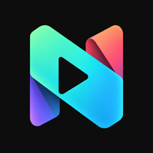

  

# NSteamLink

**把电脑上的 Steam 游戏，带到 Switch 上玩。**

NSteamLink 是一款面向 Nintendo Switch 自制系统的 Steam Remote Play 客户端。
电脑运行游戏，Switch 接收画面和声音，并把你的操作传回电脑。
拿起 Joy-Con，选择电脑，就可以继续上次的游戏。

[下载最新版](https://github.com/kxn/nsteamlink/releases/latest) · [English](README.en.md) · [反馈问题](https://github.com/kxn/nsteamlink/issues)

## 能做什么

- **配对一次，随时连接**：首页持续查找电脑，分别保存每台电脑的配对和最近游戏。
- **从最近游戏继续**：带封面的游戏卡片，选中即可请求电脑启动游戏并开始串流。
- **适合掌机的操作**：摇杆、方向键和触摸都能浏览游戏；卡片支持横向平滑滚动。
- **专心玩游戏**：全屏画面、Joy-Con 振动，菜单按需呼出，不常驻遮挡。
- **在 Switch 上结束游戏**：可以只断开串流，也可以请求电脑退出游戏。
- **按自己的习惯使用**：中英文界面、画面偏好和界面提示音。
- **从 HOME 菜单启动**：应用内添加启动入口，后续直接点图标打开。

## 开始游玩

你需要一台能运行自制软件的 Switch，以及一台开启了 **Steam Remote Play** 的电脑。
先让两台设备连接同一局域网；电脑需要保持开机并运行 Steam。

1. 从 [Releases](https://github.com/kxn/nsteamlink/releases/latest) 下载 `.nro` 文件。
2. 将它保存为 SD 卡上的 `switch/nsteamlink/nsteamlink.nro`。
3. **按住 R 启动一个游戏**，进入全内存 hbmenu，再打开 NSteamLink。
4. 选择发现的电脑，将 Switch 显示的配对码输入电脑上的 Steam，按提示完成连接。

**不要从相册的 applet 模式启动。** 内存不足以运行串流，应用会显示提示并允许按 B 返回。

首次可以用 **Y 打开 Steam**。游玩后，首页会记录最近游戏；下次可以直接选择卡片启动。

## 常用操作

| 场景 | 操作 |
|---|---|
| 选择游戏 | 左右推动摇杆／方向键，或触摸滑动卡片 |
| 切换电脑 | L / R（多台电脑时显示提示） |
| 启动所选游戏／确认 | A |
| 打开 Steam | Y |
| 打开选项 | X |
| 返回／退出 | B |
| 串流中呼出菜单 | 同时长按 **− 和 + 0.8 秒** |

首页和菜单也支持触摸。串流菜单中的 **断开连接** 会让电脑上的游戏继续运行；
**结束游戏** 则请求电脑退出游戏并结束此次游玩。

## 添加到 HOME 菜单

打开 **X 选项 → 添加到 HOME 菜单**，确认后即可添加入口，无需手动提供密钥文件。
这需要你的自制系统支持自制应用的安装与启动。

入口会打开 SD 卡上的 `switch/nsteamlink/nsteamlink.nro`，请保留这个文件。
升级时将新版 NRO 替换到同一路径即可，无需重复添加入口。

## 获取帮助

遇到问题可以 [提交 Issue](https://github.com/kxn/nsteamlink/issues)，附上界面右上角的
版本号、复现步骤，以及截图或错误提示，方便定位。

想了解实现或参与开发，请阅读 [技术与开发指南](docs/TECHNICAL.md)。

## 致谢与许可

感谢 IHSlib、FFmpeg、SDL、libnx、devkitPro 和 nx-hbloader 等开源项目。
NSteamLink 以 [GPLv3](https://www.gnu.org/licenses/gpl-3.0.html) 发布，第三方组件遵循各自的许可证。

本项目是社区开发的非官方客户端，与 Valve 或 Nintendo 无关联。
