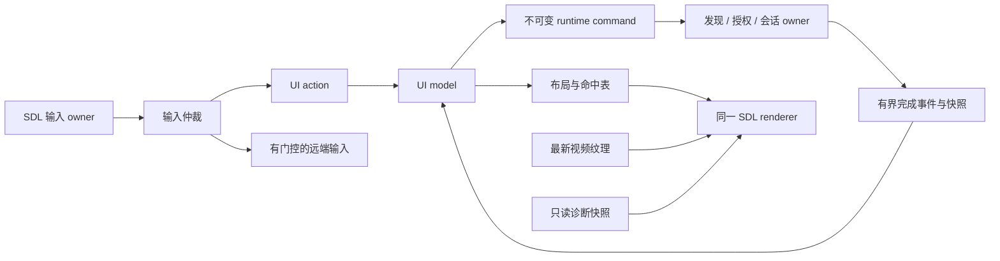

# nsteamlink 交互与接线规格

设计定稿：2026-09-08。普通用户界面以 `ui-final.html` 为视觉与交互参考；其中画框外的
场景选择、模拟网络及模拟响应按钮属于评审工具，不能进入正式应用。示例电脑、游戏和
Debug 数值不是实机数据。本文件规定目标行为与代码边界，不表示运行时代码已完成替换。
实施任务、依赖和验收状态统一记录在 [Issue #9](https://github.com/kxn/nsteamlink/issues/9)。

## 1. 产品界面

- 启动即显示首页并后台发现电脑；没有欢迎向导、扫描完成确认、刷新按钮或自动连接。
- 首页顶部是电脑标签，L/R 切换；每台电脑保留自己的焦点。发现新增设备只追加，不抢选择。
- 无任何记录及发现结果时，没有电脑占位卡。仅显示“正在查找电脑／尚未发现电脑”和
  “在同一网络中打开 Steam”；网络恢复后自动继续。短时间漏收广播不删除电脑。
- 新发现电脑显示广播名称，系统作辅助辨认。IP 只在同名、名称缺失及电脑信息中显示。
  不生成“客厅／书房”昵称，不凭广播推断账号、授权或游戏库。
- 已有配对和游玩记录的电脑显示最近游戏，最多同时显示两项；记录属于该电脑和已确认账号。
  没有历史时仅显示“开始游玩”。新发现且无本机授权记录时仅显示“配对并连接”。
- 暂未发现的电脑保留上次名称，正文显示“暂未发现这台电脑”；隐藏启动入口。
  此状态不等于关机。详情中的地址标为“上次地址”。
- Y／“电脑信息”显示系统、地址、发现状态、本机配对记录。手动地址输入仅位于
  X 选项 → 设置 → 高级 → 手动添加电脑；空状态、帮助正文不主动推荐输入地址。
- 配对码在 Switch 显示，在电脑上的 Steam 输入。收到授权成功并成功落盘后自动继续原连接意图，
  不插入“配对成功”完成页。连接安全码只在流请求返回 `PINRequired` 时输入，不能混用。
- 串流铺满 1280×720 画布；保留视频宽高比，源画面比例不同时可有画面留黑，不能为应用栏缩小视频。
  品牌栏、电脑标签、底部操作栏全部隐藏。不保留常驻悬浮入口。开流显示一次“同时长按 − + 打开菜单”，2.8 秒后开始渐隐，4.2 秒时完全消失；提示不接管触摸。
- 本地游玩菜单叠在视频上；关闭菜单即恢复输入。视频及音频继续处理，菜单不承诺暂停游戏。
  断开只停止本地串流，不发退出电脑游戏指令；退出应用必须完成资源清理。
- 错误显示可执行的短文案及重试／取消。连接未完成前显示不定进度，不编造百分比。

原生布局采用 1280×720 逻辑坐标；正文 28–32 px、标题 40–44 px、辅助信息不小于 24 px，
按键提示 24–26 px。触摸区域不小于 64×64 逻辑像素。长名称允许两行或尾部省略，详情显示完整值，
不得为塞进一行整体缩小字体。浏览器小尺寸重排只服务设计预览，Switch 不使用网页布局引擎。
沿用定稿的深蓝背景、浅色文字和单一蓝色焦点；实际系统主题由平台适配，不让网络状态抢占整页颜色。

## 2. 输入与焦点

| 场景 | 手柄 | 触摸／鼠标 |
|---|---|---|
| 首页 | L/R 换电脑，方向键移动，A 执行，B 退出确认，X 选项，Y 电脑信息 | 点标签只换电脑；点游戏或主操作才连接；各命令按钮执行自身动作 |
| 配对／连接中 | B 取消 | 点取消；点击码、标题、空白不操作 |
| 数字输入 | 方向键+A 数字键盘，X 删除，B 返回，提交按钮确认 | 点数字、删除和提交；手动 IP 不要求外接键盘 |
| 串流 | 普通按键交给游戏；同时长按 − 和 + 800 ms 打开本地菜单 | 视频区域全部转发触摸，按用户修订移除常驻触摸菜单入口 |
| 本地菜单 | 方向键+A，B 返回；普通输入不再传给游戏 | 点菜单项及返回；背景触摸不传给游戏 |
| Debug 切换 | **仅本地游玩菜单内**单独长按 X 1000 ms | 正常产品不增加入口；评审可通过场景选择器查看 |

同一个布局对象同时输出控件 ID、绘制矩形、命中区域和方向邻接表。点击目标来自被点控件，
手柄 A 的目标来自当前焦点，最终进入同一个业务 action。页面容器和诊断字段不能被解析为按钮。
一根手指在 down 时确定 local/remote 所有者，此次 motion/up 不再换所有者；过滤 SDL 的触摸合成鼠标事件，
防止一次触摸执行两次。坐标须经逻辑画布／视频有效区域变换，画面留黑区不转发为游戏点击。

### 组合键与输入仲裁

普通游戏输入、菜单输入、只读诊断分别建模，不能用一个 `enabled` 开关代替全部状态。
UI 和 SDL HID 必须从同一份规范化按键状态得到结果，libnx 原始读数只保留作平台采样或只读诊断。

- −/+ 识别采用 100 ms 首键窗口：首键短暂缓冲；窗口内出现另一键则进入组合候选，
  两键同时保持 800 ms 才打开菜单。没有第二键则按原顺序发送缓冲事件。
  未达到长按阈值的组合候选按原顺序释放为普通输入。不能吞单独的 −/+，也不能把单键延迟到 800 ms。
  **单独 −/+ 最多增加 100 ms 本地仲裁等待**，这是明确的设计代价，须用输入时序测试及实机手感验收。
- 本地菜单接管时，串行停止新的远端状态提交，按现有可靠通道顺序提交中性手柄状态，
  为已转发的触摸补 up；保持 SDL pump、主机 rumble/LED 队列应用、协议收包和媒体解码工作。
- 菜单期间维护物理状态，但不得写入待发送的游戏 canonical state。不能只挡 SDL 事件却让
  8 ms HID worker 继续发送旧的非中性状态，也不能为了开关菜单重建整个 HID provider。
- 关闭菜单进入 release barrier：消耗打开／关闭菜单的键及触摸直到释放；摇杆回中后再恢复该轴。
  新报告从中性基线按现有 delta/full 编码衔接，不重写 D-042 的 ACK、重传或编码语义。
- X 的 Debug 长按仅在本地游玩菜单识别；该菜单的短按 X 不执行动作。游戏时 X 正常转发，
  不添加等待窗口。计时只从进入菜单后新按下 X 开始；松开 X、离开菜单或失焦即取消。
  切换完成后关闭菜单，经过同一 release barrier 返回游戏。同一长按只触发一次；
  关闭浮层时重新进入菜单，再长按 X。无需同时按肩键或按压摇杆。

## 3. 高级 Debug 浮层

默认关闭、仅当前会话有效，不在主页和普通设置中展示调试数据。在本地游玩菜单中单独长按 X 一秒切换
只读浮层；同样操作关闭。断开后清除开关。浮层位于视频左上角，约 460×300 逻辑像素，
正文至少 24 px，不占布局、不消费触摸或游戏按键。菜单打开时暂时隐藏浮层，防止叠字。

| 字段 | 数据口径／来源 |
|---|---|
| 分辨率／解码器 | `stream_media_snapshot.width/height/decoder`，来自实际媒体配置与显示结果 |
| 呈现 fps | `displayed_frames` 在最近采样区间的增量 ÷ 单调时钟间隔，不能用请求的 60fps 代替 |
| 本机视频 ms | `frame_e2e_us_total / frame_e2e_samples` 的区间增量平均；现有计时起点是本机 submit，终点是 present 返回 |
| 解码／上传 ms | `decode_us_total/decode_samples` 与 `upload_us_total` 的区间增量；为上传补精确计数，不能用不匹配的帧数当分母 |
| 音频缓冲 ms | 当前 S16LE 队列字节数 ÷（实际采样率 × 声道 × 2）×1000；无音频时显示“—” |
| HID 待发／在途 | `reliability.hidPending/hidInFlight`，不把已提交误写为已应用 |
| 最大 ACK 等待 ms | `reliability.reliableMaxAckLatencyMs`，标清为会话累计最大值，不命名为网络 ping 或端到端输入延迟 |

视觉参考将分辨率与解码器合为标题，其余六行。无样本为“—”；缓存过期时标“数据已过期”，
冻结旧值不伪装成实时值。协议／会话错误及更完整记录仍通过既有有界日志和 UDP debug 获取，
浮层不复制整屏日志，也不显示 PIN、secret key、session key 或完整账号 ID。

统计聚合由诊断 owner 以 1 Hz 更新双缓冲快照；浮层开关只影响绘制，不改变采样与传输。
渲染只读取最近完成的快照，不等待协议 mutex，不做磁盘／UDP 读写或每帧字符串格式化。
`frame_e2e` 不能对外宣称为 host→屏幕或按键→游戏生效延迟；present 返回也不等同实际扫描出屏。

## 4. 代码依据与接线落点

以下证据基于父仓 `9a4c829` 及其 IHSlib pin；符号为接线锚点，行号仅帮助定位。

| 接口／功能 | 源码证据 | 接线决定 |
|---|---|---|
| 正式入口 | `app/src/main.c` 跳到 `nsteamlink_stream_main`；`app/CMakeLists.txt` 把 `client/main.c` 宏改名并打开 `NSTREAMLINK_APP` | 正式入口运行共用应用 controller；从自测入口抽取 runtime 服务，不再链接自测 `main` |
| 图形与首屏 | `client/media.c:1089 draw_idle_indicator` 画移动条及橙块；init 与无帧 present 均调用 | 删除该动画及其所有调用；首页由新 UI 绘制，不靠视频帧驱动 |
| 原 UI | `main.c:3107 update_screen_ui`、`media.c:209 font_rows`、`:326 draw_ui_overlay`、`media.h stream_media_ui` | 全量删除行式 UI 和自制 ASCII 点阵字库，换为有语义控件的 SDL2 绘制 |
| 无授权启动 | `main.c:4069` 无 auth 进错误；`:1792 ensure_ihs_started` 拒绝未配对状态 | 图形初始化与设备身份初始化先于授权；只需稳定身份即可创建发现 client |
| 首次授权 | `tools/switch-discover/main.c:217/255/277/351/430` 生成身份、配对回调与保存 | 提取为正式 auth service；复用真实授权回调，不启动另一个 NRO、不解析工具屏幕字符串 |
| 发现 | `discovery.c:37/81` 支持周期 timer；`main.c:1385 send_discovery_once` 另向固定 IP 发包 | 应用拥有单一周期发现生命周期；删除正式路径的硬编码 `FALLBACK_HOST` 和主动固定 IP 探测 |
| 主机记录 | `IHS_HostInfo` 无配对／账号／游戏列表；`main.c:904 host_find` 用 clientId+instanceId+IP 查找 | 引入 registry，将广播观察值、持久主机记录及授权关系分离，不拿列表下标作请求身份 |
| 流请求 | `start_stream_request`、`stream_worker_enqueue`；`:1510 IHS_StreamingRequest` | worker 接不可变 request：host record ID、地址快照、已确认账号、gameid、设置快照、generation |
| 首帧 | `on_stream_success` 只表示流请求接受；`on_video_start` 只表示配置；`first_frame_displayed` 才有呈现证据 | 成功响应后继续等待 session 和首帧；首帧前保留连接画面，不能提前标“已开始游玩” |
| 输入 | `main.c handle_input` 读 libnx；`media.c:930 pump_sdl_events` 直接向 IHS 发送触摸／HID；`:1279` 有独立 flush worker | 单一 SDL 事件 owner → 输入仲裁 → 本地 actions 或远端事件；为 HID worker 增加独立门控，保留其生命周期 |
| 停流／退出 | `request_app_exit`、`join_destroy_session` 与 `main.c:4260` 后的清理 | UI 只发命令；runtime owner 执行有界 stop/join/destroy，完成事件后回首页／退出 |
| 最近游戏直启 | `discovery.proto:227 gameid` 存在但公共 request 未开放；`ch_control.c:685` 忽略 SetActivity/SetIcon | 通过 IHSlib fork 增加 request.gameid 和活动回调；应用只记录实际收到的有效活动。依赖 #7 |
| Steam 菜单 | 公共输入接口存在键盘、触摸、HID，但没有已核实的“打开 Steam 菜单”应用 API | 保留设计 action，验证受支持的 Guide／host UI 请求后开放；不能默默改成桌面串流、重连或硬编码 Shift+Tab |
| 画面／声音 | `on_session_configuring` 使用 720p60/6000kbps 上限；media 有本地 Opus/SDL audio | 画面偏好映射到下次请求及 session 配置；静音作用本地输出，不改变系统物理音量或电脑音量 |
| Debug | `media.h stream_media_snapshot`、`IHS_SessionReliabilityStats`、有界诊断线程 | 新增 snapshot adapter 和新绘制模块；不复用旧八行文本 UI |

## 5. 模块与所有权

目标为 C11，共用业务层禁止 Switch 平台宏；公开符号采用 `sl_` 前缀。

| 目标模块 | 职责 |
|---|---|
| `app/src/ui/ui_model.*` | 页面／弹层、host selection、逐主机焦点、用户意图与 request generation；纯状态转移 |
| `app/src/ui/ui_layout.*` | 逻辑坐标布局、绘制命令、触摸命中和焦点邻接；无 IHS／SDL 调用 |
| `app/src/input/input_router.*` | 规范化输入、组合键时序、local/remote ownership、release barrier |
| `app/src/services/host_registry.*` | 周期发现事件合并、last_seen、保存主机、过期及稳定选择 |
| `app/src/services/auth_store.*` | 设备身份、授权记录、旧格式迁移与原子保存；不从回调直接写盘 |
| `app/src/services/recent_games.*` | 按 host record + 确认账号保存 gameid/name；有界记录，无游戏时提供 Steam 入口 |
| `app/src/diagnostics/debug_snapshot.*` | 有界统计聚合、单位／样本口径、过期标记；独立于旧 UI |
| `app/src/platform/runtime.h` | 网络、流请求、取消、停流、退出、设置与完成事件接口 |
| `app/src/platform/ui_renderer.h` | 字体／纹理／绘制接口；不泄露 SDL 类型至业务状态 |
| `app/platforms/switch/` | 现有 IHS/FFmpeg/SDL/线程生命周期的适配，libnx 字体、文件与设备能力 |
| `app/platforms/desktop/` | 同一 UI 的 SDL2 预览与可注入事件 runtime；真实协议后端另由 adapter 接入，不冒充已具备桌面串流 |

具体抽取粒度可按文件体积调整，但上述所有权不能合并回一个带大量平台宏的 main。
自测工具使用 runtime 服务和独立入口，不能让正式应用反向编译自测主程序。

IHS callbacks 复制必要数据到有界队列，不绘制、不写盘、不调用退出。主线程先处理事件，再处理用户 action，
再生成画面。重复 discovery 按 host 合并；终态事件单独保留容量，不能被大量发现或统计事件挤掉。
取消使 generation 失效；迟到 success 不可打开 UI 或绑定新目标，若已建立资源仍须交 runtime 清理。

### 状态与存储

状态不再复用 `PROBE_*` 加 `ui_pin_mode` 等布尔组合：

- 页面状态：Home、Pairing、SavingAuth、Connecting、ConnectPIN、Streaming、Stopping、Error、Closing。
- 会话目标独立于首页选择；modal stack、debug visibility、远端输入 owner 分别维护。
- 只有有效且可用的会话可接远端输入；Streaming 展示状态以首帧呈现建立，首帧失败回可操作错误页。
- 本地随机 `host_record_id` 是持久引用；广播 clientId 是观察到的匹配信息，instanceId 是会话代次，
  IP 是地址。不能用房间名、hostname、IP 或列表位置作为永久唯一身份。冲突不静默合并授权。
- 稳定设备身份与逐 host 授权／账号、last-known 信息和最近游戏分开存储。旧 auth.bin 的设备 ID 与
  secret 必须保留，不能升级 UI 时随机重建；旧 lastHost 缺少可验证的主机 clientId，保留原 auth.bin，上次地址仅作为后台定向发现候选，不自动导入授权；重新配对绑定真实响应的主机，不能给所有发现主机授予同一账号。
  同名／同 IP 不足以绑定旧记录；由显式选择及真实授权／已认证连接结果建立关联。
- 新存储使用带版本和长度校验的有界格式，保存走临时文件、flush、原子替换，失败保留旧有效文件。
  PIN 不进入历史或日志。身份缺失、格式损坏、普通未配对必须是不同事件，不能统一黑屏退出。
- 首页发现初始周期建议 3 秒，超过 15 秒未观察到主机才标“暂未发现”；这些是产品初值，
  实机广播频率与耗电是验收变量。HTML 的 2.5 秒／8 秒仅为了方便评审观察，不能照抄定时器。

### 渲染与字体

保留一个 SDL window/renderer 及现有 FFmpeg/NVTEGRA 上传链路，不引入第二个图形后端。
拆分 event pump、上传新帧、重绘已有纹理、绘制 UI、present；无新视频帧时也必须绘制菜单与连接状态。
仅新视频帧成功呈现才增加 displayed_frames，重绘相同纹理不能虚增 fps。

字体改为 SDL2_ttf 和有界字形／文字纹理缓存。Switch 从 libnx `pl:u` 获取系统共享字体，
标准字形与中文 fallback 经 HAL 提供；桌面通过字体 provider 提供对应字体。系统字体只运行时读取，
不能提取后打包入仓库。字体对象与缓存先于 renderer/pl 服务销毁；字体失败不回退到旧点阵 UI。
端侧已存在 `SDL2_ttf.pc`，接入需在依赖表登记并验证双目标链接。

## 6. 功能接入边界

| 能力 | 可交付行为 |
|---|---|
| 发现／配对／Steam 串流 | 由已有协议能力接入，UI 初始化及回调状态重构后必须在单个应用内贯通 |
| 多电脑 | 新 registry 与逐主机授权持久化为必需能力，不能用一个全局 steam_id 伪装 |
| 最近游戏直启 | `gameid` 请求、真实活动记录和确认目标链路一起交付；不足时回退无历史的 Steam 入口，不放假的可点游戏卡 |
| 游戏图片 | SetIcon 仅是来源线索，不能假定有完整库封面 API；图片不可用时用真实游戏名的文字卡，不联网抓任意图片 |
| 打开 Steam 菜单 | 单独 capability 检验；适配未获证据前不向发行版绘制可点但无效的菜单项 |
| 画面偏好 | 均衡 720p60/6000kbps，流畅 720p60/4000kbps，清晰 720p60/10000kbps 请求上限；真实协商值单独记录，不承诺 host 一定接受 |
| 自动重连 | 由 #11 的会话恢复设计负责；本规格保证故障可取消／重试／回首页，不借 UI 改造宣称自动重连已实现 |

## 7. 旧实现删除契约

替换完成时，下列第一方运行时代码与构建路径必须删除，不允许 `legacy_ui`、`#if 0`、旧 UI 开关、
备用动画或 debug 浮层借壳保留。新 UI 与旧实现删除属于同一个替换交付的完整性条件。

| 删除对象 | 范围 |
|---|---|
| SDL idle 动画 | `draw_idle_indicator`、内部 tick/rail/bar/marker、init 与 present 调用、仅为动画存在的判断及状态 |
| 行式旧 UI | `update_screen_ui`、`ui_set_line`、`draw_ui_overlay`、`stream_media_set_ui`、`stream_media_ui`、相关 stub 和常量 |
| 自制字库 | `font_rows`、只服务旧字库的 `draw_text`、字符点阵表与固定八行布局 |
| 旧交互状态 | `ui_desktop/ui_pin_mode/ui_pin_cursor/ui_pin/ui_notice` 及旧 PIN 改数、X 模式切换、Y 手动刷新分支 |
| 音量退出 | `LOCAL_HOTKEY_MASK`、`LOCAL_VOLUME_POLL_MS`、`local_volume_change`、audctl 轮询／init/exit、旧 hotkey/volume 诊断字段及文案 |
| 正式产品的 probe 行为 | 宏改名的自测入口、自动 stream/限帧退出、固定 FALLBACK_HOST、要求运行 M2 配对的产品错误页、console 旧屏幕分支 |
| 动画验证目标 | `tools/switch-gfx-probe/sdl_official.cpp`、`gl_official.cpp` 及其 CMake target/default build/artifact 列表引用；生命周期证据留在历史记录，源码可从 git history 取回 |

独立 discovery/stream 自测的非图形协议及生命周期断言可以保留为工具，但必须消费新的 runtime 服务，
不保留旧产品菜单、动画、点阵渲染器或音量键退出分支。现有协议日志、诊断快照、可靠性代码、
媒体解码上传和安全清理是服务能力，按功能抽取，不因旧 UI 删除而丢失。
第三方上游测试／示例与 append-only 历史决策不是产品残留，不删除协议证据来制造“零命中”。

清理验证覆盖第一方源码、CMake 源列表、脚本、用户使用说明与干净构建后的链接符号；旧 build 缓存
不作为验收产物。README 的热键与 M2 外置配对说明在运行时替换交付时同步更新，不能提前写成已经可用。

## 8. 验收约束

桌面先运行同一份 UI/model 与真实鼠标、touch 事件、手柄／键盘模拟；不是只测 HTML，也不是只测 A 键。
至少覆盖无电脑持续等待→自动发现、重名、名称缺失、无授权首次启动、配对拒绝／超时／保存失败、
安全码、取消迟到成功、多主机焦点、真实历史隔离、首帧等待、无新视频帧时菜单重绘、断流与重连入口。

输入测试必须检查发送给假 transport 的事件内容和顺序：点击 X/Y 不产生流请求、触摸控件不泄露
remote down、打开菜单发中性态、关闭菜单无粘键、单独 −/+ 可用、组合键短按与长按只触发一次、
Debug 不阻断游戏输入或重置统计。HID 变化遵守 fork 的 D-042 测试，不擅自改变传输协议。

真机验收区分可见画面、输入到达、流接受、首帧和 hbmenu 返回证据。涉及 runtime、输入 worker、
SDL 与退出的替换需安排有依据的生命周期测试；按 AGENTS.md 说明第二次启动的证据价值后再约用户操作，
不擅自部署或触发 netloader。普通开发的快照和鼠标测试不要求用户配合真机。

正式 UI 的完成条件包含旧实现删除、桌面与 Switch 构建通过、上述关键路径和源码残留检查。
具体任务拆分与测试通过状态只在 Issue #9 及关联 issue 维护。

### 连接过渡与控件字体

配对请求开始时保留简洁连接画面；若主机迅速认可原设备身份，直接继续串流，
不闪现 code/保存弹窗。code 已产生但 1.8 秒仍未完成授权时，才展开配对说明和大号 code。
协议请求、授权成功和安全码语义不变；不把计时结束当成授权。
控件文本按实际字形可见边界和统一基线计算垂直中心，不用固定上边距代替居中。
按钮采用圆角、明确的焦点描边和填充，ABXY 用圆形按键徽标，L/R 用肩键轮廓；
游戏卡只有真实标题和通用进入图标，不伪造游戏封面。

### 品牌与视觉层次

标题栏显示 NSteamLink、http://github.com/kxn/nsteamlink 和 CMake PROJECT_VERSION；
版本仅来自构建元数据，不手写第二份版本号。首页使用初始化时缓存的低对比背景、
统一细分隔线、电脑图标和按键提示。卡片和弹窗采用一套圆角、边框与轻阴影。
焦点描边在140ms内平滑移向新控件，控件本体和命中区不移动；弹窗文字和背景使用180ms
渐入。连接进度使用无百分比的轻量往返指示，不能代表已完成的协议进度。
串流仍无常驻装饰；全部视觉资源由SDL拥有，在字体/renderer销毁之前释放。
