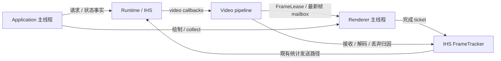

# Switch 硬件帧直显与统一图形后端设计

设计日期：2026-09-09。对应决策：D-051。实施任务、依赖、进度与实测结果仅在
[Issue #8](https://github.com/kxn/nsteamlink/issues/8) 维护；本文只定义架构、接口契约与验收规范。
本设计不是已经实现的行为。证据基线为 `a6f743465817913a965ca075276c1f231420cc98`。
架构修订：应用协调停止、FrameTracker 统一统计、renderer 统一 GPU 使用期；本文各节为修订后的完整契约。
§14–19 将上述契约对应到当前函数、拟新增接口、关键算法和交错验收；其中代码是设计伪码，
不代表仓库已有实现。可直接开始 CPU 契约与 SDL 封装工作；Switch 导入参数和不可取消等待仍受 G1 约束。

## 1. 目标与边界

Switch 使用 deko3d C API 独占图形设备、graphics queue、默认 NWindow 和 swapchain。
FFmpeg 输出 NVTEGRA 硬件帧后，renderer 直接采样其 Y/UV surface；不经过整帧 VIC 下载、
CPU 解块或 SDL 视频纹理上传。视频颜色转换、缩放写入最终渲染目标，UI 在同一 queue 上合成。
desktop 保留 SDL 图形后端，共享 UI 状态、布局、交互及绘制语义。

收益目标是消除可确认的整帧中转、反复分配和无必要同步，降低 CPU 工作与内存流量，增加帧时间余量。
zero-copy 只指解码 surface 到视频采样输入不复制；解码写入、纹理采样、最终画面写入和显示同步仍存在。
不以“FPS 仍是 60”判定无收益，也不承诺固定的输入到屏幕延迟降幅。

首版范围：H.264、8-bit 4:2:0、默认 720p60；保留完整 UI、音频、输入、截图诊断与软件解码兜底。
对 1080p 的尺寸/裁剪设计不写死 720，但不借本迁移改变协商分辨率；正式 1080p 产品支持属于 #12。
不改 Steam 协议、认证/PIN 语义、网络重传、音频后端或 HID 报告协议；自动重连策略仍属于 #11。
不增加 FSR、锐化、HDR、10-bit、第二条图形 queue 或新的 UI 框架。

## 2. 证据与需要纠正的旧解释

| ID | 可复核证据 | 支撑的结论 |
|---|---|---|
| E1 | `application.c:106–142` 的自有 while loop；`media.c:836` 请求 vsync | 呈现由应用驱动，不是固定帧率系统 callback |
| E2 | `media.c:1323–1465`，每次输出硬件帧均分配下载缓冲、transfer，再 stash | 当前存在每帧分配和整帧中转；被覆盖的 pending 也已付出 transfer 成本 |
| E3 | `media.c:1731–1746,1838–1909,1912–1959` | 新帧才上传；无新帧复用旧 SDL texture 并重画 UI |
| E4 | `media.c:2137–2158`；`runtime.c:422–444,990–1012` | start/stop 使用 present→decoder 锁；主线程退出会 join runtime，worker 会 stop/join session |
| E5 | `ui_renderer.c`、`sdl_input.c`、`app/CMakeLists.txt` | UI 外部已封装，但内部纹理、字体缓存、裁剪、离屏弹窗与截图依赖 SDL |
| E6 | [#2 验收](https://github.com/kxn/nsteamlink/issues/2#issuecomment-5449587930)、[#10 基线](https://github.com/kxn/nsteamlink/issues/10#issuecomment-5451990123) | VIC 路径已通过；旧会话 transfer 1.71 ms、upload 2.12 ms，不代表当前版本新测量 |
| E7 | FFmpeg `nvtegra_decode.c` 的 `post_process = ff_nvtegra_wait_decode`；`decode.c` 调 post_process 后释放 private_ref | 所审阅分支成功输出帧前已经等待硬件解码；不能杜撰公开 decode fence 接口 |
| E8 | FFmpeg `hwcontext_nvtegra.c` 的 pool、frame/map 引用；Moonlight `updateFrameMapping()` | 可以以同一 backing 创建 DkMemBlock 并缓存 Y/UV 映射；不能把整个 AVFrame 永久钉在映射缓存里 |
| E9 | SDL `SWITCH_VideoInit/PumpEvents` 初始化/轮询 touch、keyboard、mouse、swkb，PumpEvents 调 appletMainLoop | 关闭 SDL VIDEO 会同时失去这些事件；当前 application 外层也调 appletMainLoop，存在两个调用点 |
| E10 | deko3d v0.5.0 `dk_memblock.cpp`、`dk_swapchain.cpp`、`dk_queue.cpp`、Primer | storage 不等于复制；GPU 访问、命令/描述符生命周期和显示 acquire 仍要单独管理 |
| E11 | `third_party/ihslib/src/session/callbacks.c:79–100`、`frame_stats.c:131–157,237–268`、`channels/video/ch_data_video.c` 的 stats drain/send | Complete 使用调用时刻；缺失完成记录会成为 DroppedLate，结果发送给主机，不是可随意丢弃的日志 |
| E12 | `runtime.c:860–894` 的 video watchdog；`ui_renderer.c:208–240` 的字形 LRU | 现有 watchdog 只识别 host video stop；录制 UI 时就可能触发纹理淘汰 |
| E13 | `runtime.c:754–762,993–1002`；`application.c:116` | 通用 worker 执行同步保存/命令，destroy 阻塞 join；现有输入 gate 每轮按 UI 覆写 |
| E14 | ihslib `ch_control_video.c:53–61`、`ch_data.c:127–131`、`session.c:142–161` | 同 session 可重启 video；start 失败会断开且不走常规 stop；数据 worker 的 join 还发生在 session destroy 内 |
| E15 | ihslib `ch_data_video.c:169–185,276–285`、`ch_data.c:127–131` | 应用 start 成功后，channel 仍可能因控制消息发送失败而启动失败；统计 timer 已注册，不能只回滚应用 start 内部资源 |
| E16 | D-046 状态语义修订；`runtime.c:860–869`、ihslib `test_video_control.c:214–232` | StopVideoData 只关闭视频通道，暂停视频 watchdog；StartVideoData 可在同 session 恢复，不是会话结束 |
| E17 | ihslib `ihs_timer.c:228–255,272–280`、`ch_data_video.c:208–273,398–406,424–431` | timer 执行回调时持全局/自身锁；视频统计又取 stateMutex，而接收线程持该锁执行解码回调，解码等待会阻塞其他 timer 的调度 |

撤回旧解释：#10 基线评论中的 `decode + transfer + … ≈ frameLat` 不能作为自洽证明。
当前 `media.c:1500–1511` 和历史 `fd77eed:client/media.c:1776–1787` 均将 receive/transfer
包含在 decode 计时里。保留原始数值，禁止重复求和；`Present` 返回也不是物理屏幕完成扫描的证据。
E9 证明重复 lifecycle 调用点，不证明目前已经因此出现设备故障。
撤回本设计初稿“report trylock 竞争只遗漏诊断，不影响视频统计”的解释：E11 与之相矛盾。
回报必须保留发生时刻、完成结果和会话归属。
架构修订撤回“逐帧 outbox 交给通用 runtime worker”与“所有 renderer fatal 按视频代次过滤”的选择。
E11/E13 支持将统计接收/完成/过期放在同一模块，E10 支持 device 故障归属 application。
不再沿用主线程先阻塞 join、再开始 GPU drain 的顺序；默认保留关闭的 codec domain 到外部使用结束，
撤回把跨 codec free 引用保证作为首版正常停止前提的选择。具体替代契约见 §3–5、§10。
这些是设计修正，不是已经修复或实机验证的行为；不改变 wire 字段、认证/PIN 或连接流程语义。
撤回“应用 start 成功就等于 channel 启动事务完成”的隐含前提，按 E15 划分回滚责任。
明确保留 E16 的视频暂停语义；“主机结束”仅指既有会话结束判定，不能从 StopVideoData 推断。
首版撤回跨 decoder domain 共用 pool/PoolGroup 的许可，使旧 domain 的映射归零条件独立于新 domain。

审阅来源（固定版本，实施时与实际 portlibs 来源再核对）：

- [FFmpeg NVTEGRA decode](https://github.com/averne/FFmpeg/blob/caeec83b791be08ed43468a2ef426d6901d51c78/libavcodec/nvtegra_decode.c)、
  [FFmpeg receive/post-process](https://github.com/averne/FFmpeg/blob/caeec83b791be08ed43468a2ef426d6901d51c78/libavcodec/decode.c)、
  [surface pool](https://github.com/averne/FFmpeg/blob/caeec83b791be08ed43468a2ef426d6901d51c78/libavutil/hwcontext_nvtegra.c)、
  [context/pool 析构](https://github.com/averne/FFmpeg/blob/caeec83b791be08ed43468a2ef426d6901d51c78/libavutil/hwcontext.c)。
- [Moonlight renderer](https://github.com/XITRIX/Moonlight-Switch/blob/a75fee223914f36ec26b29739d95331307960fa3/app/src/streaming/video/deko3d/DKVideoRenderer.cpp)。
  参考映射方法，不整体搬入它的 Borealis、后处理与 C++ 管理结构。
- [deko3d v0.5.0](https://github.com/devkitPro/deko3d/tree/5cc144dcf5606fbcd78430f6c62923546e5f9cf4)、
  [Primer](https://github.com/devkitPro/deko3d/blob/5cc144dcf5606fbcd78430f6c62923546e5f9cf4/Primer.md)。
- [SDL Switch video](https://github.com/devkitPro/SDL/blob/0738d3c9f6993875e2f3dd0e8cc0bb4ae4440b4e/src/video/switch/SDL_switchvideo.c)。
- 本地 SDK 示例：`/opt/devkitpro/examples/switch/graphics/deko3d/deko_basic/source/main.c`；
  SDK 头：`/opt/devkitpro/libnx/include/deko3d.h`、portlibs 的 `libavutil/hwcontext_nvtegra.h`。
- 本机包：deko3d `0.5.0-1`、uam `1.1.0-1`、libnx `4.12.0-1`、FFmpeg `7.1-5`、
  SDL `2.28.5-4`、SDL_ttf `2.22.0-2`。审阅 FFmpeg 分支不自动等于发行包的精确源码。

## 3. 职责与所有权

图形设备属于 application；协议连接属于 runtime；解码资源属于 video pipeline；GPU 使用期属于
renderer。主线程协调应用状态，各子系统只销毁自己拥有、且已无使用者的资源。
线程数保持现状，不新增渲染线程、通用消息总线或 detached worker。

| 模块 / 执行者 | 独占职责 | 对外边界 |
|---|---|---|
| `application.c` + `app_lifecycle.c/.h`（新增，主线程） | 运行/暂停/停止/退出策略、输入准入、新会话 admission | 请求 runtime 操作；消费事实快照；驱动 renderer collect |
| `runtime.c`（既有 worker） | IHS session/client、音频/HID 会话连接；执行 stop/join/destroy | 返回带 session 身份的事实；不消费逐帧图形完成队列 |
| `video_pipeline.c/.h`（新增） | decoder domain、帧 mailbox、解码回调串行化、关闭后的 codec 回收 | 交付只读 `FrameLease`；不创建 Dk 对象，不等待 main ack |
| `frame_lifetime.c/.h`（新增） | FrameLease 与 GpuBatch 的引用不变量、析构条件 | desktop 假 GPU 可独立验证；不持有 session 裸指针 |
| ihslib `frame_tracker.c/.h` + `frame_stats.c/.h` | 前者管理帧身份、阶段、完成、过期和 endpoint；后者承担统计聚合与发送快照 | renderer 只写 ticket 结果；不负责解释 wire id 或访问 session |
| `platform/gfx.h`、`common/gfx_backend.h`（新增） | 公开 gfx HAL 与内部 AVFrame 桥接 | 业务层不可包含 SDL/FFmpeg/deko 类型 |
| `platforms/{desktop,switch}/gfx.c`（新增，主线程） | 全部 GPU 对象、批次、cache 版本、提交与回收 | desktop 用 SDL；Switch 用 deko；UI 只持不透明纹理句柄 |
| `switch/video_surface.c/.h`（新增） | surface 校验、按 pool 分组的映射缓存 | 由 renderer 驱动创建/退役；不拥有 decoder |
| `platform/events.h`、`platforms/{desktop,switch}/events.c`（新增） | 单一 lifecycle/event pump 与平台状态 | 提供 foreground、触摸/键鼠事件；不直接覆写最终输入 gate |
| `ui_renderer.c`、`media.c` | UI 绘制/字体与音频/HID facade | 不自行处理 GPU fence；media 不拥有窗口 |
| `switch/shaders/`（新增） | YUV、RGBA、基础形状 shader | uam 构建时编译 |



箭头表示数据/调用边界，不代表彼此阻塞等待。FrameTracker 的具体消费发生在 IHS 统计路径，
不绕行 runtime 的配置保存、启动或停止命令。改变本地统计接口不改变 wire 消息与认证流程。

### 3.1 身份分层

| 身份 | 创建与失效 | 用途 |
|---|---|---|
| `ui_request_id` | 用户发起新操作 | 沿用 UI generation 语义，过滤过期业务事件 |
| `session_id` | runtime 创建一次 IHS session，销毁后不复用 | 操作/事实/错误归属，不用裸指针作唯一身份 |
| `video_epoch` | 每次成功 video start，在同一 session 内也递增 | decoder/帧发布准入；stop 只关闭对应 epoch |
| `pool_id` | 实际 hw_frames_ctx/pool 改变 | 映射与预算；尺寸相同也可能是新 pool |
| `frame_serial` / `submission_serial` | 本地单调 64-bit 序号 | 帧身份与 GPU 使用期 |

这些 id 不互相替代。runtime 显式保存 ui_request→session→video epoch 的关联；UI 事件携带原请求身份，
不能把迟到事实改写为当前 UI 请求。16-bit Steam frameId 仅在 FrameTracker 内处理协议关联。
图形设备的健康状态属于 application 整个寿命，不能按 video epoch 过滤。

### 3.2 图形接口

保留 C11，接口形状如下；`begin/present/poll_drain` 的 backend 实现细节不得泄漏到 UI：

```c
typedef struct sl_gfx sl_gfx;
typedef struct sl_gfx_texture sl_gfx_texture;
typedef enum { SL_GFX_READY, SL_GFX_BUSY, SL_GFX_SUSPENDED,
               SL_GFX_CAPACITY, SL_GFX_ERROR } sl_gfx_result;
typedef struct {
    sl_gfx_result result;
    bool submitted;
    bool output_returned;
    uint64_t submission_serial; // submitted 时有效，不代表 GPU 已完成
} sl_gfx_present_result;

sl_gfx *sl_gfx_create(const sl_gfx_config *config);
sl_gfx_result sl_gfx_begin(sl_gfx *gfx);
sl_gfx_present_result sl_gfx_present(sl_gfx *gfx);
void sl_gfx_collect(sl_gfx *gfx);
sl_gfx_result sl_gfx_poll_drain(sl_gfx *gfx); // 检查/有界推进，不内部循环等待
void sl_gfx_destroy(sl_gfx *gfx);            // 已完成 drain，或已证明 GPU 停止
```

矩形坐标左上原点、1280×720 逻辑空间；明确 RGBA8/R8 与内部 NV12/YUV420P 格式、pitch、bytes。
`sl_ui_renderer_create(sl_gfx *)` 替换 `void *native_renderer`；移除 `sl_media_renderer()`。
SDL_ttf 仍在 CPU 栅格化，UI 经 HAL 上传像素；destroy_texture 只是移除逻辑引用，物理回收由 renderer 处理。

acquire 前预留命令/UBO/顶点/描述符、GpuBatch 引用表、fence 与独立 emergency-clear 容量。
acquire 后可以发生可失败的 import/glyph miss；此时使用已保留 current、常驻缺字占位或 clear 收尾。
不得依赖再次分配归还输出。v0.5.0 无通用取消 acquire API；begin 成功后的每条返回路径都必须
记录是否已归还输出、是否已有命令入 queue，不能把 present 失败直接解释为“GPU 未使用资源”。

## 4. 应用状态、线程与准入

### 4.1 主线程协调，子系统报告事实

application 维护 `Idle / Starting / Streaming / Stopping / Exiting / DeviceFailed`；foreground/suspend
是独立平台状态，不能用某个 UI 页面代替。用户 stop、主机结束和可恢复视频故障进入同一个
Stopping 流程；exit 意图一旦确定不再撤销，DeviceFailed 禁止新的图形工作。
主机视频暂停是独立的 `host_video_paused` 事实。StopVideoData 仅关闭对应 epoch 并回收其视频资源，
保留 session、音频/HID 与 UI 交互，不进入应用 Stopping；会话结束仍按 D-046 的既有证据判定。
新 StartVideoData 清除该暂停事实，但不能清除已锁存的应用 stop/exit 或设备故障。

runtime 保留协议必要的断开/故障处理，向 application 报告带 session_id 的事实；不得为了等待主线程
而阻止 IHS 必需的协议收尾。应用收到事实后协调 renderer 和 UI，协议断开不依赖 UI 消费事件。
停止进度必须能从持久快照重新读取，不能只靠可能拥塞的普通 UI 事件队列传递一次 ack。

runtime 接口拆成异步 request_stop/request_exit、poll_state 和最终 join/destroy；request 幂等，
同一 session 的 stop/exit 不被普通命令覆盖。主线程在 Stopping/Exiting 中继续 pump/collect，
不提前调用会等待活动 worker 的 destroy。线程只能在已经不再依赖主线程推进后最终 join。
此结构不保证底层 I/O/SDK 调用天然可中断；其阻塞边界见 §10。

用户切换会话时，最多保存一个尚未启动的用户意图；取消/退出可清除它。只有旧 session 已销毁、
旧 FrameLease/GPU 映射已退完且 decoder domain 已销毁，才请求新 session start。
这是本地 admission 策略，代价是切换等待清理；不增加自动重连，不影响稳态视频提交。
主机在同一 session 内替换视频 channel 不经过此 admission，单独遵循 §5.4。

### 4.2 唯一输入准入

application 的统一入口计算：

`allow_remote = ui_wants_remote && foreground && session_connected && !stopping && !exiting && !faulted`

UI、平台和 renderer 只提供条件，不各自调用 `sl_media_gate(true/false)` 覆盖最终值。
必须同步修改 application、SDL/native input adapter 的既有 gate 写入点；远端输入转发前使用同一
准入结果。关闭时沿既有 HID 中立状态处理，恢复重新采样；本地退出/菜单操作始终可处理。
renderer 发布本地故障的同一轮就更新 faulted；不等待 runtime/UI 错误事件回来才禁用输入。
旧 session 的事件不改变新 session 的准入，device 故障则对整个 application 生效。

### 4.3 锁与提交边界

- decoder_lock 串行 video start/submit/stop；主线程不获取它，runtime 只在关闭后回收 domain 时使用它。
- mailbox 锁只交换 FrameLease、发布 epoch、closing 标记；摘出的引用在锁外释放。
- 主线程取帧/重绘时，在 mailbox 临界区核对 epoch 并取得该次使用的 lease，随后解锁录制。
  stop 关闭后禁止新的使用预留；关闭前已取得的一次使用允许收尾。该交错不要求锁内 submit。
- start/stop 可 decoder→短 mailbox；禁止 mailbox→decoder。GPU 操作、join、析构和日志均在 mailbox 锁外。
- FrameTracker 自己管理统计锁；main 的完成发布不取该锁、不调用 session API，不新增 report_lock。
- IHS 统计 timer 不取 video stateMutex/decoder_lock，不等待解码、GPU 或主线程。接收方发布原子
  帧计数，timer 读取独立快照/增量；diagnostics OFF 同样成立。tracker 锁内不调用 timer start/stop
  或可能重入 IHS 的发送/日志路径；先取有界统计快照，锁外编码/发送，避免与 timer→tracker 反向。
- callback 只冻结/发布关闭的 decoder domain，不能等待 renderer ack；runtime 轮询完成条件后回收，
  不持锁等 main。任何新锁边必须连同 IHS 内部锁一起审计。

## 5. FrameLease、GpuBatch 与帧跟踪

### 5.1 帧与 GPU 使用期

`FrameLease` 是有界 envelope，包含 AVFrame 强引用、session_id/video_epoch/pool_id/frame_serial、
颜色/裁剪信息和可选的帧完成 ticket；不含 session 裸指针或 Dk 对象。
数据只读，引用可在 decoder mailbox、current 和 GPU 批次之间移交；使用预分配 AVFrame + move_ref，
不逐帧 clone/alloc 整帧。最后一个外部 lease 释放只回收帧并减少 domain 的使用计数，
不能在任意线程顺带销毁 decoder 或 GPU cache。

逻辑位置是 Pending→Candidate→Current→Retired；丢弃未呈现输出直接释放。
当前帧没有新输入时继续保留；新帧成功 present 才替换它。session/epoch 关闭时移除 current，
已经取得的录制/提交引用继续有效，之后不能再预留旧视频。重绘不重复计首呈现。

所有 GPU 资源统一交给 `GpuBatch`：`Free → Recording → Submitted → Complete → Free`。
写入命令地址/描述符前即取得资源引用，包括 frame/map、atlas 子区版本、封面、软件纹理、离屏 target、
readback 缓冲和命令存储。UI cache 逻辑淘汰不处理 fence，也不能覆写这些引用仍保护的区域。
未提交批次可取消并释放引用；提交时将引用整体转为 Submitted；最后完成才回收。
同一帧 A 重绘三次再换 B，A 必须等最后一次使用完成，不能看第一次 fence。

present 返回 submitted=true 而 result=ERROR 时，仍保留批次；没有可验证 fence 时走 device 故障边界。
设备错误不能用普通取消释放。emergency-clear 只替换尚未入 queue 的命令，不能撤销已提交工作。
软件 staging 与软件 current 纹理是不同寿命：批次可复用不等于 current 像素可覆写。

初始容量：pending=1、candidate=1、current=1、GPU 批次=2、应用 AVFrame 壳对象=8
（最多两个 domain scratch + 六个 FrameLease envelope）。容量统计按唯一对象而非引用数；
包含旧 epoch 在途引用，耗尽时仍处理压缩输入的
解码参考关系，丢弃无法交付的输出并明确计数。`extra_hw_frames=6` 为显示持有余量，不是 decoder pool 上限。

### 5.2 FrameTracker 是统计的唯一所有者

接收身份、decode 阶段、显示/丢弃结果、过期、drain 统一在 ihslib FrameTracker 中定义。
移除“main→通用 runtime worker→旧 stats API”的逐帧 outbox；runtime 不承担其调度或截止操作。
扩展 `frame_stats.c/.h`、session 回报接口、video 接收/统计发送接入点和测试，保留原 wire 字段、
时间单位、发送节奏及认证/连接语义。现有调用方通过 adapter 接入同一存储，不再维护两份帧结果。

FrameTracker 提供引用计数的 CPU-only endpoint 和固定容量记录（初始 256 条）。endpoint 不持有
session/renderer/decoder；IHS 拥有活动引用，帧 ticket 持有记录使用引用，session 销毁不使 ticket 悬空。
记录身份为 `(session_id, video_epoch, receive_serial, slot_version)`；16-bit frameId 仅是记录字段。
接收方完整初始化记录后才发布 ticket；同一帧分片更新同一记录，不重复分配。

接口语义：`begin_received` / `record_decode_stage` / `complete(ticket, outcome, timestamps)` /
`settle_and_drain` / `close_epoch` / `close_endpoint`。renderer 只调用 complete 并释放 ticket；decoder→renderer 移交时
一并移交“报告最终结果”的权利，pending 被覆盖由 decoder 侧终结，已取走的帧不能再由它回报。
关闭时由实际摘出 pending 的 owner 终结该 ticket；移交在 mailbox 临界区完成，main 与 callback
不能分别给同一帧报告一次丢弃。帧已首呈现后 ticket 可归还，current/GpuBatch 的像素引用继续保留。
复杂 receive/输出对应关系由 PTS/COPY_OPAQUE fixture 证明；没有可靠归因不能伪造 ticket。

complete 是非阻塞、无需堆分配的单 writer 发布：写入结果与显式时间戳后 release 发布 ready；
IHS 消费端 acquire 后才能读 payload。时间在事件发生处采集，用有效位表达零值；硬件导入不伪造为 upload。
Displayed 另带 renderer 单调 presentation_serial；呈现间隔按真实呈现顺序计算，不按可能重排的 wire id 求时间差。
过期/关闭只改变消费资格，不能覆写仍有 producer 引用的记录；记录复用必须同时满足已结算和
所有 ticket 引用归零，slot_version 不复用。这样旧 ticket 永远不能写坏新接收记录。
endpoint 生命周期和 slot 分配可由 IHS 锁保护，main 的完成发布不能回到这把锁；ticket 释放也不得
同步获取统计锁，可原子归还引用，由持有 endpoint 引用的 IHS 消费端收集。关闭后的 endpoint 只剩
CPU 存储，最终无引用时释放；不回调已退出的 IHS 服务。endpoint 关闭前须停止/排除其消费与发送使用。
统计发送的既有 1 Hz 节奏保留，但必须替换 E17 的 FPS 读取锁路径。仅把 complete 移进 tracker
不能消除该阻塞：ReportVideoStats 在 drain 前等待 video stateMutex 仍会拖住 IHS 全局 timer。
只统计 CPU 计数的快照不依赖解码完成；此调整不解决 NVDEC 自身不可取消的问题（§10.3）。
实际原子宽度/内存序由 G0 验证；不以未经证明的“lock-free”口号替代实现。

结算规则必须共同实现，不能只增加时间戳参数后沿用 acquire_slot：

- 以接收身份跟踪尚未终结的帧；先收到后序 Displayed 不能立即把前序正在解码/呈现的帧判丢。
- 连续的终态记录才能推进结算位置；缺失/未终结记录有显式有界等待策略，然后按真实已知结果或
  既有 DroppedLate 语义结算。初始等待策略 250 ms，从该帧接收时刻计，与本地 suspend/epoch close 分开处理。
  保持协议 latest_frame_id 的显示边界语义，不能把一个普通丢弃结果当成已显示推进。
  本地结算/回收位置与 wire 显示前沿分开：长时间没有 Displayed 也要回收已终结且无 ticket 引用的记录，
  以有界累计量保留统计，不能为等待下一次显示而占满记录池。逐帧明细的保留窗口有界，过期明细
  单独计数；不得伪造 Displayed 或漏记已接受的完成结果。完整报文与累计值须由 G0 fixture 核实。
- 16-bit 回绕通过内部扩展序号处理；同 epoch 的有效比较窗口小于半个序号空间，歧义输入明确报错，
  不回退游标或绕行 65535 条记录。channel 重启时的 wire id 连续/重置语义必须用协议证据与 fixture 校验。
  首接收位置显式初始化；遍历以记录容量为限，缺号区间不能展开成无界逐 id 循环。
- 已结算或关闭之后才发布的结果只计 late/closed completion，不复活旧 slot、不写新会话；
  本地真实呈现计数独立保留。endpoint 关闭不承诺向已断开的主机发送剩余统计。
  close_epoch 不关闭同 session 的新 epoch；关闭与结果发布的先后以 tracker 内定义的结算边界判定。
- 容量饱和先在 tracker 内结算可过期记录；仍无空闲时显式返回 tracking pressure，通知停止该视频流，
  不覆盖有引用的记录。解码仍安全处理已接受输入；不能让 renderer 等配置保存或吞掉已经取得 ticket 的完成结果。

上述规则属于本地统计兼容改造，必须先用真实 aggregator 的 128 槽覆盖反例、乱序完成、回绕、
关闭/发布交错与诊断 OFF 验证。256 条记录不是延迟上界证明；等待策略与发送结果需同旧统计 fixture 对照。
若不能证明 wire 语义一致，停止该统计接口的集成，不通过伪造 frameId 或关闭统计绕过。

### 5.3 关闭 decoder 的默认策略

默认保留整个已停止的 decoder domain 到 renderer 外部使用归零，不以输出帧可跨 codec free
作为正常 stop 的前提。domain 包含 codec、其 hw/device 引用和使用计数，由 video pipeline 创建，
callback 串行使用；stop 冻结后进入 pipeline 的待回收集合，runtime worker 最终执行 codec 析构。
callback 不销毁在 GPU 使用中的对象，也不等待 GPU。

最终 codec 析构条件：该 domain 不再有 callback 使用、pending/candidate/current/批次 lease 全部释放、
该 domain 独占的 renderer PoolGroup 映射已销毁。decoder 自身 DPB 引用不计为“外部 lease”，否则会形成自我等待。
最后一个 lease 释放仅发布完成事实，runtime 在锁外/专属回收阶段销毁；GPU 对象始终由主线程销毁。
输出跨 codec free 的优化不是首版必需路径；如未来采用，需另有发行包证据和决策，不能运行时混用。

### 5.4 同 session 的视频重启与 start 失败

IHS 会在同一 session 内移除旧 video channel 再创建新 channel；不能把它当成新 UI 请求或新 session。
必须区分应用 decoder start 回调与 IHS channel 的 DataStart，启动事务由 channel 层负责：

1. 应用回调先预留 domain 容量、完整初始化，再发布 epoch 并返回成功。回调自身失败时，只撤销
   未发布对象与预留；不得要求 IHS 对失败回调补一次 stop。
2. 回调成功后，channel 记录 `app_started` 及其 epoch 绑定，继续注册统计 timer、发送 decoder info。
   这两步也属于启动事务；timer 注册失败或消息发送失败，必须在 DataStart 返回失败前完成 rollback。
3. rollback 先停止/排除已注册 timer 的执行，再恰好一次关闭已启动的应用 epoch。已发布 domain
   进入 §5.3 的冻结回收流程，不能当作未发布初始化对象直接 free，也不能等未来 stop callback 才关闭。
4. 正常 DataStop、失败 rollback 和 ChannelVideoDeinit 的防御清理共用 channel 级幂等收尾入口。
   deinit 必须先 join data worker，再检查其 timer/app_started 清理记录；不得与仍执行的 start 并发回滚。
   timer 以 channel 为 owner，停止返回代表没有回调再使用 channel/tracker；清理在 decoder/mailbox/
   tracker 锁外执行，不能持这些锁等待 timer。channel 内存释放前两项所有权都须归还。

现有 IHS 在 DataStart 失败时断开 session 且跳过常规 DataStop（E15）；该 disconnect 行为保留。
不能把 start 失败当作可重试 busy。应用回调成功后发生失败是独立验收分支，不包含在“应用初始化逐点失败”中。

全管线同时保留 decoder domain 最多 2（一个活动、一个退役；也可能两个均退役）。新 epoch 可以在
旧 epoch 的 GPU 使用结束前准备，旧 current 随 close 退役，主线程不再取旧帧。第三个 domain 无容量时
明确以资源压力使 start 失败并收尾整个会话，向 UI 传递准确原因；不是静默等待或自动重试。
用户主动切换会话由 §4 的串行 admission 避免这种重叠；主机连续重配的压力行为必须单独验收。
同一 session 内的不同 pool 仍按 §6.3 分组，domain 上限不能代替 pool 的上限。
应用 stop/exit 关闭整个 session 的发布准入，和只关闭一个 epoch 的标记分开保存。已进入 start
的回调在 mailbox 下发布前重新检查 session 准入；关闭后不得发布新 epoch/pending 或重新打开 bridge。
发布先于关闭则按已发布对象收尾；关闭先于发布则回滚未发布对象。该检查不依赖主线程取得 decoder_lock。

## 6. 硬件 surface 导入、缓存与同步

### 6.1 解码完成契约

仅接受 `avcodec_receive_frame()` 成功输出的帧，不从 decoder 内部正在写的对象偷取 surface。
E7 对应源码已经等待 NVDEC 完成并剥离 private_ref，首版不再添加 CPU 的第二次 decode wait。
发行包必须先核对相同 post_process 行为；若不同，须先确定可用的完成等待机制，再允许直显。
这不等于解码没有耗时，只是 renderer 不需再管理未公开的 NVDEC fence。

### 6.2 导入验证

在调用 `av_nvtegra_frame_get_fbuf_map` 前检查 format、hw_frames_ctx、buf[0]、AVNVTegraFrame/map_ref，
其内联 helper 本身不做空指针检查。由固定 ABI adapter 读取字段，禁止在通用代码强转私有结构。

仅 NVTEGRA + `sw_format=NV12`、8-bit、受支持的 progressive/layout 能进入硬件直显。
检查 map base/size 的 4KB 对齐、非零大小、map 是否 block-linear、data[0] 对 base 的真实偏移、
UV 偏移、pitch、pool 的分配宽高、frame 可见宽高、crop、每个平面的边界。
尺寸乘法/offset 使用 checked size_t/64-bit 算术，拒绝溢出，不对 map size 向上取整后访问未知内存。

Y 映射 `R8_Unorm`、UV 映射 `RG8_Unorm`，使用 `DkImageFlags_UsageVideo` 和经验证的布局。
`dkImageLayoutGetSize/Alignment` 必须满足 backing 的真实可用范围。**不能只把可见的 1280×720
直接当成存储尺寸**，也不能只用 width 推导 UV offset。覆盖 720/1080 的 padding、crop、pitch
变化以及跨 pool 尺寸不变案例。不支持的奇数尺寸/位深/隔行布局走显式失败或第 9 节兜底。

### 6.3 映射缓存

key = `(session_id, video_epoch, pool_id, map_ref 身份, handle, base, size, plane offsets, pitches)`。
不能仅用 handle/地址，防止重连或 allocator 复用形成 ABA。相同布局也要比较 pool 身份。

以 `DkMemBlockMaker.storage = map_base` 创建映射；初始 flags 参考上游
`CpuUncached | GpuCached | Image`。**不得设置 ZeroFillInit，不得对已解码 backing memset。**
传入 storage 时 DkMemBlock 不拥有原 allocation；销毁顺序为完成 GPU 使用→销毁 DkMemBlock→
释放缓存的 map_ref/hw_frames_ctx 引用。FFmpeg 仍拥有原 surface 分配。

缓存持有 `AVNVTegraFrame.map_ref` 和该 pool 的 `hw_frames_ctx` 强引用，确保映射期间地址有效；
不永久持有 `AVFrame.buf[0]`，否则 pool 认为 surface 始终在用，反而每帧申请新 surface。
frame 的 current/submission 引用才负责阻止解码器覆写“正在读”的内容。
同一 surface 返回 pool 后被重新解码，缓存映射可复用，但内容序号必须变化。

缓存的 owner 是 renderer 的 PoolGroup，每组唯一归属一个 decoder domain 和实际 pool；
映射 entry 保留其使用的 session/epoch 身份。首版每个 domain 独立创建 hw/device context，
不复用其他 domain 的 hw_frames_ctx、surface pool 或 PoolGroup。引用 wrapper 的地址不同不证明
底层 pool 不同，身份须来自受强引用保护的实际 context/pool。跨 domain 别名在创建映射前明确拒绝，
不能通过另起 pool_id 把共享 backing 伪装成独占；G1 核实实际包符合该隔离契约。
全 renderer 最多 2 个 PoolGroup、每组最多 32 个 map；唯一 backing 映射预算 128 MiB。
不是“每个 epoch 各自再有两个 group”，也不是 FFmpeg 内部 pool 的数量/字节上限。
同 pool 内只淘汰无 Candidate/Recording/Current/Submitted 引用的 cache 条目；导入失败不改变 current。

新 pool 被准入或所属 epoch 关闭后，旧 group 标记 Retiring，不再增加缓存条目；epoch 仍有效且
还持有旧 current 时可以继续采样，
新 candidate 成功替换或 epoch close 后才释放该 current。group 最后一个外部使用结束就整组销毁
所有 Dk 映射和 cache 的 map/context 引用，不等 LRU 压力。group 使用计数仅包含外部帧/GPU 使用，
不把 decoder 自身 DPB 或缓存自己的强引用算进去。关闭 A 只退役 A 的组，不改变 B 的准入；
A 的映射归零事实不等待 B 停止。所有旧 group 都在使用时拒绝第三组导入，走视频资源
压力收尾；不继续累计旧 pool。失败分支先释放未提交的部分映射，再归还其 group 容量。

分别记录导入映射字节、renderer 保留的 pool 数、pool/context 析构及 FFmpeg 实际内存高水位。
hw_frames_ctx 可能保留未导入的 surface；128 MiB 不能充当完整 decoder 内存上限。
renderer 清掉 group 与 runtime 销毁 codec 是两个完成条件，后者还会释放 DPB/pool 引用。
G1 必须核实发行包的 pool 分配计量或保守容量估算，覆盖反复同代换 pool，确认旧 pool 的实际回落；
观测不到的字节标为 unknown，不以映射数代替。容量不足允许明确拒绝格式，不能靠无限扩容兑现支持。

### 6.4 GPU 可见性与命令寿命

NVDEC 完成与 GPU texture cache 看到新内容是两个条件。即使 map key 没变，新 frame_serial
第一次采样前也要确保纹理/L2 的可见性。首版以经 SDK 验证的 image+L2 invalidation 和 queue flush
边界保守实现；仅重绘相同内容可省掉该失效。描述符变化要 invalidate descriptor cache。
不能以“映射命中缓存”为由省略新内容的同步；不能将 CPU cache flush 当成 NVDEC 完成等待。

采用一条 graphics queue；每个 submission slot 有独立、预分配的命令内存、UBO、顶点和描述符区域。
slot 从 Recording 开始到 fence 完成前不能覆盖上述数据，即使函数 `SubmitCommands` 已返回。
fence 对象本身也属于 submission slot；不能在尚有资源引用该 serial 时重写为下一次提交的 fence。
用 `submission_serial → slot/version` 检查对应关系，保留完成水位或明确的完成集合。
视频与 UI 的全屏输入、采样器、blend/scissor 状态在每次 pass 显式设置，避免相互污染。
离屏弹窗 target 转为采样源时插入对应 barrier；普通视频不经过离屏 RGBA target。
不在稳态调用 `dkQueueWaitIdle()`；只在受控 teardown 使用，且必须有故障处理契约。

## 7. 主循环与显示节奏

主循环每轮先处理控制与回收，再决定是否呈现：

1. 单一 platform event pump 收集原始输入、更新 foreground；读取 runtime 的持久事实快照。
2. application 推进生命周期、计算输入准入，再分发远端输入；优先处理 exit、device 故障、会话终止。
   event pump 不能在准入更新前直接向 session 转发原始事件，本地菜单/退出不受远端准入阻挡。
3. renderer collect 完成批次/退役 pool；发布 renderer 使用结束的事实，runtime 轮询回收关闭的 codec domain。
4. Stopping 时不再取该 session 视频，正常 gfx 可继续画 UI；Exiting/DeviceFailed 禁止新批次，
   仅处理已经 acquired 的收尾、collect 与停止状态推进。无可呈现 foreground 时有界让出。
5. Starting/Streaming 及正常 UI 绘制有空批次才 begin；预留必要容量后 acquire，再取最新 pending。
   核对 epoch，导入 candidate 并取得 Recording 引用；失败按错误作用域收尾，不更改 current。
6. 绘制视频/UI，提交并记录批次 fence，再 present；发布 ticket 完成结果和本地呈现健康快照。
   首帧 UI 事件从当前 session 的真实首次 present 生成，不等待 FrameTracker drain 或一秒诊断采样。
7. 执行应用级视频/图形健康判断，推进 stop；下一轮继续 event pump。

runtime 中旧的视频首帧/停滞 watchdog 迁至 application，避免两套状态机同时判定。
runtime 可继续读取带 session_id/video_epoch 的呈现快照供既有 launch/activity 逻辑使用，
不能用跨代累计计数变化推断新会话首帧。诊断开关不改变首帧事件或健康判断。

swapchain 初始 2 张 RGBA8、无 MSAA/深度缓冲；swap interval=1。命令在途最多 2，pending=1。
不引入积满再播的软件 FIFO。输出固定 1280×720，dock 不自动启用 1080p。
正常状态每个显示节拍重画 current+UI；不将 UI 动画绑在新视频上，不同时实现 idle 按需渲染。
busy/suspend 用有界短等待避免忙转；不在正常显示节拍上额外照搬 SDL_Delay(1)。

`dkQueueAcquireImage` 内部 NWindow dequeue 无主机侧 timeout；GPU queue 还等待 acquire fence。
前置 foreground/空槽检查不能证明 dequeue 有上界。G1 必须验证 HOME/suspend/退出时的返回性；
没有可返回性证据时，主循环状态机也不能保证响应，不把 acquire 移到 worker 掩盖该限制。

输出 swapchain 图像不保证保存上次像素，正常绘制每次完整覆盖；视频输入引用与显示输出 fence 分开。
停止某视频只等待该视频最后使用的批次与映射归还，不等待持续 UI 绘制的整条 queue 永久空闲。
应用退出才停止全部新绘制并 drain 全部批次，避免“边画停止动画边等待 queue idle”永远不完成。

## 8. UI、输入与平台兼容

UI 保留现有页面、尺寸、布局、动画时序、命中与系统字体。实现基本形状和纹理 quad 的批量提交，
圆角使用有界几何/覆盖率实现，避免把现有逐像素 draw call 原样翻译成独立 GPU 提交。
只合并相邻兼容 draw，不跨透明层顺序排序。

字体首版保留 512 个字形的有界 LRU 与三字体 fallback；GPU atlas/子分配支持动态 miss，
常用 UI 文本和诊断数字可预热。旧字形/封面被 LRU 淘汰时，不得覆盖本轮已录制或 GPU 在用的区域。
采用 deferred free/slot 版本，而非每次更新等待 queue idle。miss 栅格化属于内容变化成本，
不能据此宣称整个 UI 永远零分配。封面后台仍只产生 CPU 像素，GPU 上传/销毁只在主线程。
预算包含待回收版本；一轮绘制超过可用字形/atlas 容量时用常驻缺字占位或跳过该 glyph，
不能为了完成该轮 UI 驱逐前面命令引用的像素，也不能无限新增 atlas。

弹窗整体透明度保留现有“先画离屏组，再整体混合”的语义；逐控件乘 alpha 会改变重叠效果。
离屏 UI target 按提交槽管理，禁止每帧申请；视频直显路径不被此 target 包裹。
检查 straight/premultiplied alpha 的选择与纹理编码一致，保持裁剪、视口、线性过滤、字形基线。
截图走 gfx_readback 的显式诊断路径，等待对应提交并处理 cache，禁止放进稳态循环；
桌面已有 native tests 改用 HAL readback，不继续调用 sl_media_renderer/SDL_RenderReadPixels。

Switch 只初始化 SDL 的 audio/gamecontroller/events 等需要的非视频子系统，保留既有 HID provider、
8ms flush 和 rumble；禁止 SDL_CreateWindow/CreateRenderer/VIDEO 初始化。
由于 SDL 包仍带 Mesa 链接依赖，**不承诺最终 ELF 自动去掉所有 Mesa 符号/constructor**。
G1 要检验“保留非视频 SDL + deko”的被动启动/退出；若实际会初始化冲突服务，再做固定配置的
SDL 非视频构建，独立记录依赖变化，不能随意删链接参数。

platform events 负责补齐 SDL Switch video 原先承担的能力：

- appletMainLoop 只在一个 owner 中运行；desktop 仍由 SDL event pump 处理窗口。
- Switch 原生 touch 维护稳定 finger id，输出归一化逻辑坐标和 down/move/up；与 SDL 手柄事件合流。
- 焦点丢失/HOME/suspend/设备移除发送现有 SL_FOCUS_LOST，清除按键、触摸与远端保持状态，
  更新统一准入的条件；恢复后重新采样，不重发休眠前的 held 状态。adapter 不覆写最终 gate。
- USB keyboard/mouse 若作为现有 Switch 功能，须补齐键边沿、数字/小数点/退格、指针位置和去重。
  当前 PIN/手动 IP 依赖的屏上控件必须完整可用；不能因未启用 SDL VIDEO 丢掉唯一输入入口。
- SDL software keyboard 支持是否实际被应用使用需按调用点确认；不盲目初始化第二套 keyboard applet。
- 进入 foreground 后再恢复绘制；operation mode 变化只更新平台状态和坐标映射，保持首版输出尺寸。

platform owner 提供一致的 `{foreground, transition_serial, active_elapsed}`；application 在视频
watchdog 前消费恢复/暂停变化。首次视频等待与游戏视频停滞沿用原 45s/10s 策略初值，但只计允许
呈现的活跃时间；恢复重置视频等待基准。host video stopped 与本地 suspend 分开，不屏蔽真实
session 断开、认证失败、用户退出或主机停止。runtime 不再独立执行旧的视频超时分支。
沿用 D-046：`host_video_paused=true` 时，首帧和停滞 watchdog 均不计时，不设隐式的会话结束超时；
StartVideoData 恢复时重置等待基准。只有 foreground、主机未暂停视频且会话允许呈现时才累计视频
等待时间。主机恢复与本地恢复可任意先后到达，两项条件分别更新，不能互相清除。
暂停时关闭 epoch/current 后可以继续绘制现有 UI/空视频背景；不为保留画面钉住退役 decoder。
G1 核实事件/时钟在睡眠期间的实际语义，测试先暂停再恢复的完整周期，不仅测试当前 foreground 值。

## 9. 格式、颜色与回退策略

颜色信息跟随 frame，不固化在首次纹理创建：矩阵 BT.601/709、limited/full range、UV 顺序、
chroma sampling/crop 都显式配置。metadata 缺失采用与旧 SDL 路径一致且有记录的默认规则，
同时计数；不照搬 Moonlight 针对其协议强制 JPEG→limited 的修正。
用有限/全范围灰阶、彩条、1px 边缘、padding 填毒验证矩阵、上下颠倒、越界采样与黑边。
单纯换 colorspace 不重建整个 decoder/pool；存储布局改变时更新 pool/layout 身份，旧布局按最后使用退役。

| 条件 | 确定行为 |
|---|---|
| NVTEGRA NV12 合法 | 直接导入；硬件路径 transfer/upload 必须为 0 |
| FFmpeg 已回退为 software NV12/YUV420P | deko 软件上传分支，复用 staging/纹理；仍是同一个图形后端 |
| 单帧 corrupt / 临时未输出 | 不替换 current；不重复计 displayed；原有关键帧恢复逻辑保留 |
| 期望的 NVTEGRA 导入失败 | 当前已取得引用的绘制可以收尾；按 §10 通知 runtime 停止会话并清除旧 current；不偷偷逐帧回 VIC |
| 不支持的位深/布局/尺寸 | 明确拒绝；可通过既有 start 的软件 decoder 选择另开新代，不在渲染热路径切换 |
| deko 初始化/设备错误 | 受控失败清理；不能运行时再启动 SDL/Mesa 接管默认 NWindow |

软件 staging 按 submission slot 配置，CPU 写入/纹理上传不得覆盖在途资源；软件回退本身不标为 zero-copy。
迁移期间可保留编译时 `NSL_GFX_BACKEND=sdl|deko3d` 对照，两个构建分别只启用一个图形 owner，
产物与 build identity 标明 backend。正式 Switch 默认切换后，以旧版本 NRO/构建作为回滚手段，
不在流媒体会话中动态换后端。

## 10. 分阶段停止与故障作用域

### 10.1 同一条可推进的停止流程

正常 stop、用户切换会话、远端结束、可恢复视频错误和 exit 共用以下步骤；理由只决定最终 UI 和
是否退出应用，不各写一套析构顺序。

| 阶段 | application / renderer 主线程 | runtime / IHS / video pipeline | 完成条件 |
|---|---|---|---|
| 关闭准入 | latch stop/exit，关闭输入条件，关闭 bridge，移除 current/pending；已预留批次合法收尾 | 幂等接受 stop；不再启动新用户 session | 不再产生该 session 的新使用预留 |
| 停止生产与回收使用 | 保持 pump/collect；逐批释放 FrameLease、旧 PoolGroup | IHS disconnect、停止/join 音频/HID/数据 workers；callback 冻结 domain；安全关闭 tracker 的消费入口，销毁 session | 所有数据 callback 已结束；session 无剩余使用者 |
| 销毁 decoder 依赖 | 发布旧视频外部使用/映射已归零的持久事实 | 回收冻结 domain，销毁 codec/DPB/device 引用；发布 session cleanup complete | producer_closed 且外部 lease=0 且映射=0，所有 domain 回收 |
| 完成 | 普通 stop 回 Idle；允许已保留的新用户意图。exit 进入全应用最后清理 | 普通 stop 的 runtime worker 继续工作；exit 请求其退出 | 普通 stop 不销毁应用 gfx；exit 必须满足下面的全局清理 |

runtime 可以在其线程内执行 IHS join，主线程不能因此进入阻塞 join。runtime 等待 renderer 使用
归零时采用状态轮询/通知，不能持锁同步等 ack。renderer 不等待 runtime 才 collect，因此不存在
双方互等的应用级环；底层 SDK 不返回仍属于 §10.3 的独立风险。

**producer_closed 不能只依据 IHS_SessionThreadedJoin 返回。** 现有 session.c 在 destroy 内还会
join 数据 workers；必须按真实完成点发布该事实，不能抢先释放 callback 使用的 domain。
session destroy 可以早于 GPU drain，因为 FrameLease/decoder domain/关闭后 ticket 均不依赖
session；codec 和 GPU backing 则必须保留到各自最后使用结束。关闭 tracker 的发送使用后保留的
CPU endpoint 仅用于安全吸收迟到完成，不能再发包或回调 session。

stop 和 host video channel 重启可能重复触发 callback stop，按 session_id/video_epoch 幂等处理。
应用初始化失败清理未发布对象；应用回调成功后的 channel 启动失败由 §5.4 的事务 rollback 关闭
timer 与已发布 epoch。session 的最终收尾还须核对所有已发布 domain 均已冻结，不以是否收到常规
DataStop 判断资源存在。channel/tracker 的发送使用退出必须早于其内存释放。
用户新请求被保存到 application 的一个待启动槽，只有 cleanup complete 才发送实际 start。

### 10.2 错误按资源作用域收敛

| 错误类别 | 处理与资源归属 |
|---|---|
| 单帧 corrupt / 暂无输出 | 保留 current，按既有丢帧/关键帧策略处理；不启动会话析构 |
| 非必要 UI cache miss / 容量不足 | renderer 使用常驻占位；不覆盖已录制内容，不使会话失败 |
| 视频格式、导入或 domain/PoolGroup 容量失败 | 带 session_id/video_epoch 的不可丢关闭原因；application 更新 faulted 并进入统一 stop；IHS start 返回失败时接受其断开语义 |
| device/queue 故障、无法归还输出 | application 级 sticky DeviceFailed，自 gfx 创建起就存在；不按旧视频代次忽略，不接受新会话或新 GPU 工作 |
| StopVideoData / 主机视频暂停 | 仅关闭视频 epoch，暂停视频 watchdog；保留 session，允许同 session 新 StartVideoData |
| session 断开 / D-046 判定的会话结束 | runtime 协议事实驱动统一 stop；保持原正常结束/失败 UI 区分，不将 StopVideoData 映射到此行 |

renderer 返回本地错误给 application；device 故障无需经过 runtime 再通知 UI，菜单阶段同样生效。
来自 callback 的视频错误通过 pipeline 的持久状态传递，普通命令/诊断队列满也不能丢失。
先处理 exit/device 状态，再判断视频错误是否属于当前 session/epoch。旧视频的内容错误可忽略，
旧提交引发的 device 错误不能忽略。会话错误不销毁仍健康的应用级 gfx。
GPU 失效后不能再用同一 queue 绘制错误弹窗；由平台支持的错误呈现/终止路径处理，不能自动启动 SDL/Mesa。

### 10.3 SDK 等待与不可恢复故障

应用可控 fence poll 单次≤1ms；仅有未完成提交且连续 foreground 2s 无进展才判断 GPU 超时。
无新网络视频、没有在途工作或本地 suspend 均不算 GPU 卡死。正常停止仍持续推进 collect，
退出时不再 acquire 新图像；不得为了显示退出动画重新制造永远 drain 不完的工作。

G1 分别验证 NWindow acquire、graphics fence/queue 析构，以及 NVDEC receive/codec 析构等待。
引用分支的 ff_nvtegra_wait_decode 使用 syncpt_wait(..., -1)，IHS 数据线程可卡在其中，
此时 runtime join 数据 worker 也可能不返回。graphics 超时不能打断 NVDEC；主线程保持 pump
只消除应用级互等，不证明底层等待可取消。实际包的 submit timeout、channel 错误和 wait 返回
关系需源码/SDK 证据；未证明前不得承诺有界安全退出。

超时不代表 GPU/NVDEC 已停止，不能取消线程后直接 free、detach 或带未结束 worker 返回 hbmenu。
应用可恢复的分配/导入错误走统一 stop；SDK 不可恢复错误按其支持的故障终止路径处理。
deko v0.5.0 可能直接 fatal，不保证每个 API 都能转换为可恢复 result；禁止伪造异常恢复或等两秒强制释放。
保留必要资源直至设备停止被证明，无法证明时不宣称正常 loader return。

### 10.4 应用最后清理

Exiting 持续推进上述 session stop；同时对 artwork 等 app-owned producer 发 stop 请求并轮询完成。
不得先在主线程调用仍有后台工作的 blocking destroy；对应 adapter 提供 request_stop/finished，
已有 I/O 的取消/完成边界须单独验证。exit 意图不依赖继续渲染 UI 才能推进。

1. 停止所有新 GPU 批次，收尾已 acquired 输出，持续 collect/poll_drain。
2. session/data/audio/HID callbacks 全部停止；旧 FrameLease、PoolGroup、decoder domain 清理完成。
3. runtime 完成 client workers 和 IHS_Quit，artwork 等 producer 完成；主线程此时才最终 join。
   finished 的发布必须发生在最后一次使用依赖之后，不能只是“已收到 stop 请求”。
4. 全部批次完成后销毁 UI 纹理、图形 queue/命令/代码、swapchain/output backing、device，
   按 SDK 依赖逆序；swapchain 先归还 NWindow buffers，再释放其 backing，不提前 nvExit。
5. 关闭 SDL 音频/手柄与 SDL_Quit、字体/pl、诊断、socket 等依赖；所有 owner 释放完才返回 main。

保持 D-050 的 hbmenu/title takeover/HOME forwarder/NSP 分流，不增加裸 svcExitProcess。
任何生产者或 GPU 完成条件未满足，就不能把“应用已不再画图”当成可返回 loader 的依据。

## 11. 容量、计时与性能验收

资源预算独立计账：renderer 自分配初始上限 96 MiB（其中 UI 纹理/atlas ≤64 MiB）；
导入的唯一 backing 总量 ≤128 MiB，不能把同一 backing 的多个 GPU 地址映射重复计成实体内存。
预算不是整个进程内存上限：另列 FFmpeg 内部 DPB/bitstream、SDL/audio/IHS、字体、artwork CPU cache。
启动/布局变化记录各资源高水位和上限；超过预算明确报错，不在热路径无限扩容。
2 张 720p RGBA8 输出的未对齐数据量约 7.03 MiB，实际使用 DkImageLayout size；1080p 按真实布局重新算。

计时使用同一 monotonic clock，定义互不混淆的指标：

| 指标 | 定义 |
|---|---|
| decode_cpu_wall | send/receive 包含硬件等待的调用耗时；不称 NVDEC 核心耗时 |
| transfer / sw_upload | 只有中转/软件分支记录，NVTEGRA 直显应为 0 |
| pending_wait | 成功输出/发布到主线程选择；按同一 frame serial |
| surface_import | 缓存 miss 的导入成本，单独统计 miss/hit，不与稳态混为均值 |
| gfx_acquire / cpu_record / present_call | 显示资源等待、CPU 编录、提交调用分别测量 |
| submit_to_gpu_done | CPU 提交到 fence 被观察完成，包含轮询延迟，不冒充纯 GPU 时间 |
| gpu_draw | 如使用 SDK counter，使用 slot 保护的结果内存；无支持则明确 unavailable |
| frame_to_submit | 同一解码输出对应 packet 的本地提交到首次 present 调用成功；不是 photon latency |
| unique_present / redraw / output_drop | 首呈现、旧帧重绘、未呈现输出丢弃分开 |

packet/输出归因不能继续拿“当前 submit 的 frameId”强套延迟输出。使用 FFmpeg 可保留的 PTS 或
COPY_OPAQUE 携带本地 frame serial，先用 B-frame/EAGAIN fixture 验证所用 codec 的传播规则。
归因失败标记 unknown 并禁止按错误 id 回报；不假定 H.264 一次 send 总是对应一次 receive。
该修正只处理客户端计量/回报关联，不修改 Steam wire 定义。

测量采样/直方图/计数在内存有界完成，日志由既有诊断机制低频输出，不能在渲染/输入路径格式化高频日志。
tracker pressure、late/closed completion、logger 丢弃、GPU timeout 与视频 drop 独立统计。诊断 OFF 仍运行必要的完成回报、容量/
生命周期检查；不得把资源安全条件编译掉。

性能比较使用相同版本业务逻辑下的 SDL/deko 构建、相同场景、码率、刷新率、设备模式与频率策略；
固定预热 10s，采集 ≥120s，记录版本与包清单。比较 median/p95/p99、CPU 工作、资源高水位、
掉帧和 input pump 间隔；没有硬件带宽/功耗计数器时只报告理论减少的数据流，不伪造实测值。
对延后导入、映射缓存等一次性预热成本单独记录，不从会话总资源统计中抹掉。
总延迟/FPS 不变但 CPU/搬运减少属于兑现收益；工作耗时和资源都不改善则先查隐藏复制、反复映射、
每帧 waitIdle、额外 render target、cache 策略与采样口径。

## 12. 验证矩阵与实施门槛

以下为规格验收条件，勾选结果与日志链接只写 GitHub Issue。

| 门槛 | 必须回答的问题/验收 |
|---|---|
| G0 契约测试 | FrameLease 最后引用、GpuBatch 取消/部分提交、slot 复用；stop/take/submit；tracker 身份/关闭/过期/回绕/容量；UI 请求与 session/epoch 分离；唯一 gate；主循环停止推进 |
| G1 SDK/直显验证 | 固定包 receive 完成；冻结 codec 到最后 GPU 使用的寿命；同 surface 重用；完整 pool 内存与回收；YUV padding/crop/颜色；非视频 SDL 共存；acquire 与 NVDEC wait 的暂停/退出/错误边界 |
| G2 桌面结构回归 | SDL HAL 下全部既有 native/UI/input/audio/rumble/shortcut 测试；截图语义保留；diagnostics ON/OFF 构建；协议库未无关改动 |
| G3 图形完整性 | 中英文、缺字 fallback、一轮超 LRU 容量及 recording/在途淘汰、透明弹窗、菜单动画、触摸与坐标、截图、软件 NV12/IYUV；彩条与 padding 填毒 |
| G4 生命周期 | 菜单 device 错误；无视频/首帧前取消/初始化逐点失败；同 session channel 重启/start 失败不回调 stop；新请求等待 cleanup；session destroy 与最后 GPU 使用交错；HOME/睡眠/恢复；正常退出/下一次启动 |
| G5 性能与发布 | 同场景对照；NVTEGRA transfer/upload=0；稳态无反复 map 或应用整帧分配；内存不单调增长；无 input starvation；全量 UI 与双目标产物 |

G0 使用假 fence、带析构计数的 frame/map 和受控线程交错，不用“固定 sleep 恰好不失败”验证竞争。
ASan/UBSan 覆盖错误释放，TSan 用于 mailbox/tracker/lifecycle/关闭 domain 状态；桌面假 GPU 通过不等于 Switch cache 正确。

必须有以下组合反例，不能只各测一个组件：

- 帧 10 的 ticket 未完成时接收 138；旧结果不得清掉新接收记录。12→11 的完成顺序、65535→0、
  非 0 首帧、timer 与过期/关闭竞争；验证实际发送的 stats，而不只是本地计数。
- callback 完成发布后、最后 lease 释放前销毁 session；endpoint 不访问 session，codec 不提前析构。
  renderer 归零先于 producer_closed 或反之，都只析构一次；数据 worker 未退出不能报 producer_closed。
- UI 持续绘制时停止视频仍能完成；exit 后不新增批次；runtime 未结束时主循环仍 collect；
  stop/新连接/exit 连续到达不会重开准入或提前启动第二个 session。
- fatal 后下一轮 UI 仍处于串流页，gate 不得重开；旧视频错误不改变新会话，旧提交的 device 错误仍生效。
- 多次同 epoch pool 变化、第三组/第三 domain 容量拒绝、start 每阶段失败且不调用 stop，
  检查映射、lease、domain、CPU ticket 和完整 pool 的释放，而非只看 frame 数。
- 应用 start 成功后分别注入 timer 注册失败、decoder-info 发送失败；timer 已运行与 rollback 交错，
  后续 deinit/重复 stop 只关闭一次 epoch，timer 不访问已释放 channel，冻结 domain 最终释放。
- 应用 stop/exit 与 channel start 发布竞争：无论谁先取得 mailbox，关闭后不新增 epoch/pending；
  start rollback、channel join、最后 GPU 使用完成可交换顺序，不能遗留域或重开 session 准入。
- StopVideoData 暂停超过 45s/10s 再同 session StartVideoData，不误触发会话停止；本地 suspend 与
  主机暂停交错，任一尚未恢复时不累计视频等待；明确会话结束或用户退出仍立即进入停止流程。
- A 退役、B 持续出帧时，A 的 PoolGroup/codec 必须独立回收；跨 domain pool 别名明确拒绝且清理
  部分资源，不能伪造身份通过。验证回收 A 后的第三次启动可以取得 domain 容量。
- 受控暂停假的 decode callback、保持 video stateMutex 被占用时，真实 IHS 统计 timer 与其他
  定时任务仍能推进；释放假解码后可完成 stop/join。另测 timer→tracker 与 tracker close/timer stop
  交错，无锁顺序反转；不能用真实 NVDEC hang 验证此应用层锁契约。
故障注入只注入应用可恢复的分配/导入失败与假 fence timeout；不默认在用户设备上制造 GPU hang。

G1 的独立 NRO 使用本地合法 H.264 fixture，可重复暂停解码而持续绘制 UI，证明最后一帧保留；
多 pool/同地址复用测试验证 ABA 保护。可以先完成 G0/G2，再上设备，不将理论收益作为待投票问题。

生命周期高风险改动值得验证“第一次返回后第二次启动”，但按 AGENTS.md 必须先说明其证据价值，
在安排该轮手工测试时征询用户；不在每个小改动后反复索要同一测试。不接受 nxlink 正常退出代替
用户看到 hbmenu；用户不做第二次测试时，Issue 明确记录 PC cleanup 的部分证据和生命周期置信度。
仅使用已指定 Switch `10.10.10.17` 和 nxlink，不用 TCP 空连接探测 28280。

切换发布默认值前必须完成 G0–G5 中与功能/资源安全相关的验收；有未解决的 ABI/同步/lifecycle
假设时保留实验构建，不把它隐藏在软件 fallback 后发布。本设计可以降低已知风险，不能保证设备/
驱动不存在未知故障；未证实的 SDK 性质以 G1 的具体问题和失败处置管理。

## 13. 构建与可回滚交付契约

在隔离 probe 首次接入时就为 SDK 和 shader 建立可复现构建，不能留到正式切换后再补依赖。
`scripts/setup-switch-deps.sh` 显式包含 deko3d/uam；用包清单记录版本，CI 镜像仍按现有策略固定。
`app/CMakeLists.txt` 按平台/backend 选择源文件；desktop 不搜索 Switch headers、uam 或链接 deko。
`NSL_GFX_BACKEND` 是构建参数，不作为普通用户运行时设置；不允许不支持的组合静默 fallback。

uam 作为 host 程序查找，不受交叉编译 sysroot 的目标程序搜索误导；GLSL→DKSH 用明确 custom command
和 DEPENDS，生成数据嵌入产物或受控 RomFS，启动时检查 shader magic、大小与对齐。
代码内存按 SDK alignment 和 `DK_SHADER_CODE_UNUSABLE_SIZE` 留余量，shader 只初始化一次，
不能因 session 重连重复分配 code segment。输入/工具缺失时 configure/build 明确失败，不从上次目录
捡到陈旧 shader。新增源代码/依赖保留来源与许可证，不整体引入 Moonlight 的 GUI 依赖。

`cmake/BuildIdentity.cmake` 和 `scripts/validate-artifacts.py` 按需要记录/验证 backend、shader 版本；
修改身份 schema 时同步既有发布测试和使用者，避免只改生成端。
`.github/workflows/build.yml` 增加 deko 构建及诊断配置覆盖，保留桌面测试、NRO、HOME shortcut/NSP
现有产物契约。工具 target 仅随显式诊断选项构建，不随正式 release 打包。

迁移提交可以先合入仍使用 SDL 的封装/测试，但 Switch 默认切换提交必须同时具备完整视频、UI、
事件与 cleanup；不交付菜单依赖 SDL、视频依赖 deko 的中间产品。
SDL 对照与 deko 使用不同 build dir，保留版本/校验和；回滚恢复整个已知 SDL 产物，避免残留两种
backend 的对象文件。该规划不授权直接创建新 release 或向设备推送。

## 14. 源码接线与数据结构规格

### 14.1 改动定位

以下按当前 HEAD `a6f743465817913a965ca075276c1f231420cc98` 的函数名定位，行号变化时以符号为准。
新接口均为拟新增；不以声明了接口代替其接入和旧入口的移除。

| 当前文件 / 符号 | 现有行为与迁移要求 |
|---|---|
| `app/platforms/common/application.c`: `sl_application_run`, `runtime_events`, draw/event hooks | application 增加 gfx、pipeline、lifecycle owner；去掉 `while (!done && sl_system_running())` 的立即退出条件，改成退出意图锁存后继续清理；见 §18 |
| `app/src/platform/runtime.h` / `runtime.c`: `sl_runtime_submit`, `worker_main`, `execute`, `stop_session`, `destroy` | 普通请求槽与不可覆盖的 stop/exit latch 分开；原同步 stop 拆成协议关闭和 domain 回收两段；最终 destroy 不再发命令再等待 |
| `runtime.c`: `post`, `accepted`, `video_start/submit/stop`, `sample`, `activity` | `post` 不再用可变的 `active.generation` 重标旧事件；视频回调使用 session binding；首呈现通知从主线程产生，launch/activity 仍消费持续有效的媒体健康数据 |
| `app/platforms/common/media.c`: `open_decoder`, `video_start_locked`, `video_submit_locked`, `receive_frames` | 移入 `video_pipeline.c` 的 domain；取消全局 decoder/packet/frame 和 renderer-ready 前提；改输出身份归因，见 §15 |
| 同文件：`stash_frame`, `take_frame`, `stats_session`, `present_lock`, `clear_texture` | 移除旧两 AVFrame mailbox 与 session 裸指针；用 FrameLease mailbox、epoch close 和批次引用替代 |
| 同文件：`prepare_vic_transfer_frame`, transfer/convert、`draw_frame_to_sdl`, `stream_media_present` | Switch deko 硬件路径不编入 transfer；SDL backend 保留必要的桌面上传；软件格式转换归 pipeline，上传归 gfx；禁止在硬件 import 失败时进入旧函数 |
| 同文件：`pump_sdl_events`, `sl_media_gate`, `sl_media_neutral`, `video_rect` | event pump 移至 events；设备增删/rumble 工作保留明确入口；最终 gate 只有 application 写，触摸映射改读当前显示视口，见 §18.3 |
| 同文件：audio、HID worker/provider、`stream_media_get_snapshot` | 保留音频/HID 行为；拆掉对 SDL renderer/VIDEO 初始化的依赖；诊断聚合 decoder、renderer 与音频/HID 快照，不反向控制生命周期 |
| `app/platforms/common/sdl_input.c`: `sl_sdl_input` | 分离事件翻译和路由，删除末尾 `sl_media_gate(sl_ui_remote(ui))`；保留 PIN/IP 字符输入和触摸/鼠标去重 |
| `app/src/input/input_router.c`: `sl_input_sync`, `send`, `flush` | UI 的 remote 意图可保留；远端 sink 改为 application gate wrapper，`sl_input_tick` 延迟发出的组合键也受同一 gate 约束 |
| `app/platforms/common/ui_renderer.c`、`app/src/platform/ui_renderer.h` | SDL renderer/texture/rect 替换为 gfx HAL 类型；TTF 字体仍为 CPU 资源；迁移项见 §18.4 |
| `app/platforms/common/artwork.c/.h`: `worker`, `sl_artwork_destroy` | 拆出 request_stop / finished / join_destroy，复用既有 stop、DNS cancel、cond wake；CPU cache 在 worker 完成且 UI 不再访问后释放 |
| `app/platforms/switch/system.c`: `sl_system_running` | appletMainLoop 移到唯一 events owner；平台返回 false 是 exit 事实，不直接跳过清理；pl/socket 的最终释放顺序保留 |
| `third_party/ihslib/include/ihslib/video.h`, `session.h`, `src/session/callbacks.c`, `session_pri.h` | 增加 tracked 回调与 CPU ticket 接口；配置/质量回调不变；legacy 和 tracked 不得同时报告同一帧 |
| `third_party/ihslib/src/session/channels/video/ch_data_video.c` | channel 启动事务、partial/assembled ticket 移交、无解码锁的 FPS 快照、统计发送事务；重点不是只改 SubmitFrame |
| ihslib `channels/ch_data.c/.h`: `IHS_SessionChannelDataInit/Deinit`，video/audio/microphone 构造调用点 | worker 创建前完成全部可见字段初始化；补初始化失败结果与分阶段释放标记，未创建 worker 不能 join；公共签名改变时同步全部调用者 |
| ihslib `frame_stats.c/.h`, `session.c` | 256 条记录与 endpoint、快照发送、关闭及引用回收；SessionDestroy 在 data workers/timer 的访问退出后才放弃 endpoint 活动引用 |
| `app/CMakeLists.txt`, ihslib `tests/session/CMakeLists.txt`, `app/tests/test_native.c` | 按平台选 gfx/events；新纯 CPU 测试独立 target；native 截图和 input 驱动改 HAL；见 §19 |

### 14.2 application 与 pipeline 共享对象

application 在启动 runtime 前创建 pipeline，runtime 只借用；退出时在 runtime 和 renderer 都不再
访问后销毁 pipeline。不能把 pipeline 嵌入一个提前 free 的 session binding。固定 slot 的身份用
`{index, version}`，引用内可保存稳定地址，但每次新用途必须核对版本。

```c
// common/video_pipeline.h：仅供平台层；业务 UI 不包含 AVFrame。
typedef struct { uint64_t session_id, video_epoch; } sl_video_key;
typedef struct { uint32_t index; uint64_t version; } sl_domain_handle;
typedef enum { DOMAIN_FREE, DOMAIN_OPENING, DOMAIN_ACTIVE,
               DOMAIN_FROZEN, DOMAIN_DESTROYING } sl_domain_state;

struct sl_frame_lease {               // 固定 6 个 envelope，另有 2 个 domain scratch
    atomic_uint refs;
    AVFrame *frame;                   // 初始化时分配，只在独占 envelope 时 move_ref
    sl_domain_handle domain;
    sl_video_key key;
    uint64_t pool_id, frame_serial;
    IHS_FrameTicket *completion;      // 可为空；最终结果的唯一报告权
    sl_frame_metadata metadata;
};

struct sl_decoder_domain {            // 固定 2 个 slot
    sl_domain_state state;            // decoder_lock 保护
    sl_domain_handle handle;
    sl_video_key key;
    AVCodecContext *codec;
    AVBufferRef *hw_device;
    AVPacket *packet;
    AVFrame *scratch;
    atomic_uint external_frames;     // 按唯一 envelope 计，不是 refs 之和
    atomic_uint renderer_groups;     // 包含正在构造、尚未发布成功的 group
    unsigned callbacks;              // callback 最后一次访问结束前不能变成 0
    bool frozen;
};
```

同步契约：frame 像素/metadata 发布后不可改；`completion` 是独立的可移交字段，不承诺整个
envelope 按位不可变。mailbox 的短 mutex 为新帧可见性提供发布/获取边界；引用增加前调用者必须
已经持有有效引用或 mailbox 对象引用。`fetch_add(relaxed)` 只适用于这个前提；最后一次
`fetch_sub(acq_rel)` 释放 AVFrame 后，才将 domain.external_frames 减一。不能先公布外部使用归零。
free-envelope 管理复用 mailbox 的短锁或专用固定池锁；AVFrame unref 和 ticket 终结始终在锁外。
scratch 属于这 8 个壳对象预算；不能先建 8 个 envelope 又给每个 domain 额外分配 scratch。
当前最多 pending/candidate/current 各一、两批各一，共五个不同 envelope，第六个供交接；
当一次渲染同时持有旧 current 与新 candidate 时，仍按其实际唯一引用集合计数，满时不发布新输出。
冻结 domain 前清空 packet/scratch 的临时引用；FFmpeg 内部 DPB 依赖保留到最终 codec 析构。

domain 的状态转换只由 pipeline 执行；runtime reaper 在 decoder_lock 下确认冻结、callbacks=0、
外部帧=0、renderer_groups=0，摘为 DESTROYING，解锁后析构 FFmpeg，再锁内归还 slot。
析构期间 slot 仍占容量；main 不执行 codec destructor。普通 reaper 可 trylock 后延至后续循环，
不能在回收旧 A 时持全局 decoder_lock 等待 codec 析构，进而挡住活动 B。G1 仍需证明各 domain
独立 device/context 的实际析构边界。

### 14.3 调用接口与锁边

```c
sl_video_pipeline *sl_video_create(void);
void sl_video_close_session(sl_video_pipeline *, uint64_t session_id); // main，短 mailbox
sl_frame_lease *sl_video_take(sl_video_pipeline *, sl_video_key);      // main，转移 pending
bool sl_video_reserve_current(sl_video_pipeline *, sl_frame_lease *); // main，检查关闭并增引用
void sl_frame_release(sl_frame_lease *);                              // 无 session/GPU 调用
void sl_video_reap(sl_video_pipeline *);                             // runtime
bool sl_video_session_clean(sl_video_pipeline *, uint64_t session_id);// 持久事实，不消费 ack
void sl_video_destroy(sl_video_pipeline *);                          // 全部 slot FREE
```

group 构造前先登记 renderer_groups，再分配/import；失败也必须销毁部分 Dk 对象与 map/context
引用后才减计数。域仍有 FrameLease 时才能登记 group，所以计数从零重新变成非零不会越过 codec
最终析构判断。回收条件以 acquire 读取归零计数；发布归零用 release。不能用三次不相干的无锁
读取代替状态锁内的冻结和 callbacks 判断。

锁顺序允许 `decoder_lock → mailbox`；renderer 从不取 decoder_lock。runtime.lock 只复制请求/
事实，不在其中调用 IHS、pipeline、文件 I/O 或 join。timer→tracker 允许；tracker→timer 禁止。
§18 的 HID/state_lock 路径单独保留，不将它混入 mailbox 或 gfx 锁。

## 15. 视频回调、解码输出与 ticket 移交

### 15.1 明确扩展现有回调

首版选择在 `IHS_StreamVideoCallbacks` 尾部新增三个可选 tracked 函数指针，整个仓库及 vendored
ihslib 同步源码重编译；不声称兼容已有二进制 ABI。现有 start/submit/stop 与质量配置字段保留。
注册时要求三个 tracked 指针全部存在或全部不存在；tracked 模式只走 tracked 三入口，不能再
调用 legacy 三入口。质量/捕获尺寸回调仍走原字段，协议消息不变。

```c
typedef struct IHS_FrameTicket IHS_FrameTicket; // 新公共 CPU-only 不透明类型
typedef struct {
    uint64_t session_id, video_epoch;
} IHS_VideoEpochInfo;

int (*startTracked)(IHS_Session *, const IHS_VideoEpochInfo *,
                    const IHS_StreamVideoConfig *, void *context);
IHS_StreamVideoSubmitResult (*submitTracked)(IHS_Session *, const IHS_VideoEpochInfo *,
                    uint16_t frame_id, IHS_FrameTicket *borrowed_ticket,
                    IHS_Buffer *, IHS_StreamVideoFrameFlag,
                    bool *out_ticket_taken, void *context);
void (*stopTracked)(IHS_Session *, const IHS_VideoEpochInfo *, void *context);

// session worker 启动前登记；不能在已有 channel 时更改 session 身份。
bool IHS_SessionSetVideoTrackingIdentity(IHS_Session *, uint64_t session_id);
IHS_FrameTicket *IHS_FrameTicketRetain(IHS_FrameTicket *);
void IHS_FrameTicketRelease(IHS_FrameTicket *);
void IHS_FrameTicketComplete(IHS_FrameTicket *, const IHS_FrameOutcome *);
```

session_id 由 runtime 单调产生，和 immutable session binding 同时登记；channel 在启动前保留
一个不复用的 candidate epoch（失败可留下编号空洞），只有应用成功发布后才成为 pipeline 的
有效 epoch。channel 保存 epoch 值，不保存会被 reaper free 的 domain 裸指针。
runtime video callback 的 context 指向 session binding `{runtime, pipeline, session_id, ui_request_id}`；
binding 至少活到 SessionDestroy 完成，FrameLease/ticket 绝不引用它。
当前 `ChannelVideoInit` 末尾调用 DataInit 就会创建 worker；epoch、tracker、app_started=false、
timer owner、接收归因状态和报文 scratch 必须在这之前就绪，不能等 Create 返回后补字段。
把公共 DataInit 的成功/失败变成显式结果，并记录各锁/window/worker 的初始化阶段；失败逆序
清理已建子对象，Deinit 不 join 未创建的 worker。video Create 失败返回 NULL，控制通道必须检查
再 Add，走明确 session 故障；同签名的 audio/microphone 调用点同步处理构造失败，不改其音频/
协议行为。channel 已启动之后的失败才进入 app_started 驱动的 §5.4 rollback。
config/codecData 在 start 中仅借用；若 decoder 需要保留 extradata，必须检查长度、复制并补 FFmpeg
padding，不能让冻结 domain 指向会随 channel deinit 释放的 config.codecData。是否使用 extradata
沿现有 H.264 组装格式与 fixture 确定，不借此改变协商或 Annex B/AVCC 语义。

接收方在 begin_received 取得 ticket 后，每个 frame record 只有一个接收报告 owner，partial
节点仅持 ticket 的存储引用，不各自拥有终结同一画面的权利。等待关键帧、解密失败、组装失败、
channel close 由接收 owner 终结尚未移交的结果；删除单个 partial 只释放该节点的引用。
DiscardPending/Clear 按唯一 ticket 去重终结，再释放全部 partial 与 assembly 引用，不按分片数
重复报丢帧。begin_received 的接收 owner 引用也必须在提交接管/终结时释放，不能只释放 partial 引用。

`AssembleFrame` 改为返回 `{complete, frame_id, ticket}`，不再从调用者的 `states.lastFrameId`
取归因。组装第一份实际写入 buffer 的 partial 时锁存其 frameId/ticket；后续贡献片必须与该
组装身份一致，到 FrameFinish 时移交这个身份。`partial_frames.h` 节点增加 CPU ticket 引用，
Insert/Append/Remove/Clear 全部补齐 retain/release；传输 packetId、视频 sequence 与 frameId
仍是不同字段。收到别的 frameId 而旧画面未完整时不得把二者拼成同一个 token：关闭旧 assembly，
清理其 flags/expectedSubFrameStart/frameStarted/frameFinished，沿既有丢失/关键帧路径恢复。
同 id 多分片、乱序、关键帧重置及 FrameFinish 尚在待组装列表的 fixture 必须证明字节输出和身份
同时正确；若实际协议样本支持跨 id 的单画面，先修订归因模型再集成，不按最后到达包猜身份。
SubmitFrame 同步借出 ticket，应用只在成功 retain 后承担最终结果；返回错误且未接管时由 channel
终结。接管后的解码失败由应用终结，channel 不再补报。通过显式接管标志返回/记录该分界。
channel 将 out_ticket_taken 初始化 false；应用 retain 成功后、任何可能发布输出的调用前置 true，
返回后 channel 无论结果如何都释放自己的接收引用。OK 却未接管在 tracked 模式下视为契约错误。
legacy adapter 仍进入同一 tracker，但不为迟到、歧义的 16-bit id 创建覆盖 slot；新 renderer 禁用旧 session report API。

### 15.2 FFmpeg 输入输出关联

证据：当前 `video_submit_locked` 调 `receive_frames(frame_id, submit_us)`，缓存输出也沿用本次
输入 id；实际 FFmpeg 的 send/receive 解耦。固定分支及本机 `avcodec.h` 的 COPY_OPAQUE 契约
允许输入输出不是一一对应，不能仅开一个 flag 就宣称完成归因。
参见 [固定 FFmpeg API](https://github.com/averne/FFmpeg/blob/caeec83b791be08ed43468a2ef426d6901d51c78/libavcodec/avcodec.h)。

选择 `AV_CODEC_FLAG_COPY_OPAQUE` + packet.opaque_ref 的受引用保护 token；token 保存
`{key, receive_serial, borrowed-wire-id-copy, decode_begin_us, ticket, claimed}`，不保存 session。
decoder open 前设置 flag；packet PTS 可用于 fixture 辅助核对，但禁止在 opaque 丢失时临时改用
“最新输入 id”或只凭 16-bit PTS 猜测。token 元数据和 AVBuffer wrapper 的小额分配单独计量，
不将其冒称整条解码链零分配；禁止的是应用稳态整帧像素分配/复制。

首版支持经过 fixture 证明的一个组装画面至多一个可归因输出；零输出可由 token 最后引用释放、
flush/close 或 tracker 过期结算。同一 token 第二个输出、非空输出无 token、跨 epoch token 均为
归因契约失败：释放该输出并走视频故障收尾，不给两个并行 owner 同一个完成权。若实际支持的
H.264 流不满足此形状，必须在接入前扩展组装/归因规格并验证，不静默丢弃第二个合法画面作为支持。

```text
submit(input, ticket):                         // callback；decoder_lock 下
  validate bytes <= INT_MAX - padding；检查实际压缩包上限
  若 session 已关闭：不接管新输入，返回停止结果
  保留既有 need_flush/关键帧恢复策略；flush 不得释放 renderer 持有的输出
  准备 refcounted packet（压缩字节允许复制，尾部 padding 清零）
  创建 token 并接管 ticket；packet.opaque_ref = token_ref
  repeat:
    rc = avcodec_send_packet(codec, packet)
    if rc != EAGAIN: break
    drain_available_outputs()                  // 取每个输出自己的 token
    若 send/receive 双 EAGAIN 且无进展：API 契约错误，停止；不能 sleep 重试
    若已关闭：终结仍未送入的 token，退出循环
  若 send 成功：av_packet_unref(packet)，drain_available_outputs()
  否则：按真实错误终结尚未接管输出的 token，unref packet

drain_available_outputs():
  每次 receive 前 scratch 为空；receive 返回 EAGAIN 即结束本次 drain
  成功输出：验证 token/key；claim 唯一 ticket；记录该输出的 decode_end
  获取空 envelope；无容量则终结该输出结果、unref，继续 drain 保持解码状态
  move_ref(scratch -> envelope.frame)，登记 external_frames 和只读 metadata
  mailbox 下复核 session/epoch，交换 pending；锁外终结/释放被覆盖帧
  关闭后输出不再发布，锁外释放；下次循环检查停止，不为 stop 主动 drain 全部延迟画面
```

Claim ticket 在 decoder 串行域内进行；先拿走 token 的完成权，再将 AVFrame 的 opaque_ref 解除
（像素引用照常保留），避免 current/GpuBatch 额外钉住统计 token。FFmpeg 自身留存的 token
可以继续存在，但没有第二份完成权。token finalizer 只释放 CPU 引用，并对尚未 claim 的结果
作有据的未输出/关闭终结，不获取 decoder/tracker mutex、不调用 IHS session、不 free domain。
软件 decoder 的 FFmpeg 内部线程也可能触发 finalizer，不能假设它总在 submit 线程。

decode_begin/end 用输出 token 关联；send/receive 调用墙钟另记 decode_cpu_wall，不能把解码器
整体调用时间重复填给本次输出的所有帧。硬件帧直接 move_ref；软件 NV12/IYUV 使用同一 envelope，
其他软件格式使用有界可复用转换缓冲。所有接管/分配失败分支都必须列出 packet、token、scratch、
envelope 的唯一释放者。FFmpeg 内部缓冲的引用不计进 renderer external_frames。

## 16. FrameTracker 记录、发布与发送算法

### 16.1 存储与线性化点

固定 256 个 record。每个 record 分为：IHS 锁内的接收/阶段字段，唯一完成 owner 写入的
completion payload，原子发布状态，原子 ticket 引用数。不能让 consumer 过期时写 producer 的
payload，也不能让 record_decode_stage 与 complete 无锁写同一时间戳数组。
endpoint 持有自己的存储和锁；IHS 活动引用与外部 ticket 引用保证寿命，最后引用只能释放 CPU 对象。
锁的实际销毁和存储 free 发生在没有 consumer、ticket 操作者后，不依赖已退出的 IHS 全局服务。

公开 ticket 定义放在 `include/ihslib/frame_ticket.h`，生产者只使用 retain/release/complete 和
不可变 identity；内部 `frame_tracker.h` 才提供 begin/open_epoch/close_epoch/settle。接收、阶段、
结算调用使用 endpoint 的短锁；complete 不获取它。endpoint 的 Close 要求所有 tracker consumer
已停止，释放活动 owner 引用后不能再调用 tracker API；外部 ticket 引用继续保护整个存储。
Claim/Publish 分步接口仅供内部受控交错验证，成功 Claim 后必须 Publish 才能释放该引用。

`IHS_FrameOutcome` 至少包含 result、completion_us、有效位，以及可选的 upload_begin/end_us、
presentation_serial、presentation_interval_us。接收/decode 阶段只写 IHS 锁内字段；renderer 的
upload/complete 只写 payload。聚合时按阶段来源合并，不能有两处同时更新同一个 events 数组。
硬件路径 upload 有效位为 false；丢帧结果不得带虚构的 Displayed/presentation_interval。

```text
publication = OPEN | CLAIMED | READY | EXPIRED | CLOSED

complete(ticket, outcome):
  调用者仍持 ticket 引用，且已取得唯一最终结果权
  CAS OPEN -> CLAIMED                         // 完成与过期竞争的线性化点
  失败（EXPIRED/CLOSED）：原子累计 late/closed；不改结算结果
  成功：写独立 payload；store READY(release)；归还最终结果权

settle(now):                                  // IHS tracker 短锁内
  READY(acquire)：复制 payload，可结算
  OPEN 且到截止：CAS OPEN -> EXPIRED，成功才结算 DroppedLate
  CLAIMED：本轮跳过，不读未发布 payload、不循环等待 producer
  已结算且 refs=0：回收到 free-list，分配时更换 slot_version
```

close_epoch 在同一 tracker 锁下设置 epoch 不可接收/发送，并 CAS 尚为 OPEN 的记录到 CLOSED；
CLAIMED 可在关闭后完成 CPU 发布，但不能进入新 epoch 的报文。close_endpoint 先排除 timer/发送
使用，再丢 IHS 活动引用；外部 ticket 最后 release 不需要未来还有 IHS timer 才能 free endpoint。
slot 只有 ticket refs=0 才能清空，所以不会与迟到 producer 写入重叠。ticket release 的最后动作
若释放 endpoint，就不得再读 ticket/slot。引用溢出、slot_version 耗尽明确失败，禁止静默回绕。

begin_received 以 epoch+扩展 wire 序号找到同一组装帧；receive_serial 是唯一身份，不拿它替代
wire 排序。首 id 建立基准，允许范围内重排用固定表查找，半圈歧义/已经越过的输入有明确拒绝分支。
分片最后接收时间可更新，但过期时钟保留首次接收的 monotonic 时间，不因重传不断延期。
capacity 压力回收 settled 且无引用项；仍满时停止视频，不抢占 CLAIMED 或 FFmpeg 正持有的记录。

### 16.2 呈现时间和统计快照

renderer 在真实新视频 present 返回处保存 `{key, presentation_serial, present_us}`。
呈现间隔在同一主线程上相对于该 epoch 上一新视频呈现计算，连同有效位放入 completion payload；
重绘不更新该样本。这样 timer 即使先扫描到 presentation_serial=12、后读到 11，也不按扫描顺序
相减时间；不能只给记录加 serial 后继续用 `fold_slot` 的 lastFrameTimestamp 算差。
首帧没有间隔样本；epoch 切换不与旧 epoch 相减。线上的 FrameDuration 口径与既有 fixture/协议证据
逐项核对，不能因为旧按 frameId 的算法存在缺陷，就未经对照更改其他统计字段。

本地事件时间使用 monotonic 微秒；wire adapter 单独转换成既有 16.16 秒的 uint32 时间戳，
避免 `us * 65536` 的长运行溢出：先拆商余数再转换并明确取模。主机接收/发送时钟偏移沿用
`IHS_StreamClockOffset` 和 `IHS_FrameStatsEncodeEvents` 的方向、delta 编码；valid mask 表示零值。

必须分开四个位置：已接收身份、已结算记录、本地已呈现序号、已交给发送队列的 wire 前沿。
未终结记录不因后序显示立即丢弃；过期只解除本地结算阻挡。长时间没有 Displayed 时，已终结
记录可汇入固定累计量并释放，明细有固定窗口；不能把所有 record 留到下次显示。
`remoteplay.proto:934–938` 的 latest_frame_id 是 required，尚无合法显示前沿时不能凭空填一个
已显示 id。首版在本地保留有界累计量，等合法显示前沿后发送；首 id、回绕和 channel 重启的
报文样本必须通过 G0。未通过的语义分支不接入实际自适应反馈。

当前 `ReportVideoStats` 在 drain 后分配编码行，发送后才 Reset accumulator。如果未来在接收路径
也结算过期，timer 的 snapshot→发送→reset 会丢掉同时累加的新样本。因此实现要改为：

1. channel 启动事务中预留报文 scratch（256 个 frame rows、每帧至多 19 个事件及指针区），
   不把这些大数组放 timer 栈上；失败按 §5.4 回滚。fullReporting=false 不构造明细。
2. tracker 锁内把本期可发送的累计量/明细移到唯一 `pending_report`，建立 report_serial；新的
   结算立即进入下一期 accumulator。同一时刻至多一个 pending_report，不能覆盖尚未完成发送的快照。
3. 解锁后编码并调用既有 stats reliable queue。只有入队成功才提交 report_serial/发送前沿；
   成功后由既有重传机制负责可靠交付，不每秒重发同一统计样本。不能把入队当成主机已经收到。
4. 入队失败保留该快照等待明确重试或会话故障收尾，不 Reset 新一期累计量；channel close 放弃
   未发送报告时累计 closed_unsent，不能混入新 epoch。计数上限用 checked/saturating 运算并报压力。

接收线程对 FPS 只更新独立原子计数。timer 不获取 video stateMutex；tracker 锁也不跨编码/发送。
验证必须检查实际解包后的消息，包括每帧只结算一次、周期边界无丢样本、失败重试不重复入队、
初始/回绕/乱序的 latest_frame_id。G0 比较正常路径兼容性，并为已明确纠正的旧 ring 覆盖行为
建立单独 oracle；不能要求保留旧错误的逐字节输出。

## 17. Renderer 的可实施流程

### 17.1 私有硬件 adapter 与映射事务

`switch/video_surface.c` 是唯一可解读 NVTEGRA 结构的文件。返回归一化描述：

```c
typedef struct {
    uint64_t pool_id;
    AVBufferRef *map_ref, *frames_ref; // 构造事务的强引用，失败逆序释放
    void *base;
    size_t bytes;
    uint32_t handle;
    struct {
        size_t offset, accessible_bytes;
        uint32_t storage_w, storage_h, pitch_bytes;
        uint32_t tile_height;         // 只有经固定包验证的值才可设置
    } plane[2];
    sl_frame_metadata visible;
} sl_nv_surface_desc;
```

本机 `hwcontext_nvtegra.h` 的 AVNVTegraFrame 只提供 map_ref；tile/layout 不能从不存在的公开字段
读取。`nvtegra.h` 的 `av_nvtegra_map_get_addr/size/handle` 用于取 backing，plane offset 根据
frame data 与已验证 base 的整数范围计算；不要先做可能跨对象的 C 指针相减再检查越界。
layout/padding 的来源必须落实到发行包分配函数或已验证 ABI adapter，缺失则 probe 拒绝该布局。
本机与网上固定分支不能混用字段/行号作证据。

导入顺序：FrameLease 已保留→校验全部字段与预算→登记 group 构造使用→保留 map/frames refs→
创建外部 storage DkMemBlock→构造 Y/UV layout/image→完整成功后加入 cache。任一步失败清理已经
创建的 Dk 对象，随后释放 FFmpeg refs，最后撤销 group 登记。group 重用时必须核对实际底层
context/map 身份；不能只比 AVBufferRef wrapper 或 allocator 地址。

`DkImageLayoutMaker` 的 pitchStride/tileSize 是 union。block-linear 的 tile 配置与线性 pitch
不能同时写入；Y 为 R8、UV 为 RG8，UV 横向单位是二通道 texel。两平面的 storage/crop 分别算，
不能把 Y 的 width、pitch 字节数或 720 高度照抄给 UV。先验证 GetSize/Alignment 与各 plane
真实可用区间，再 ImageInitialize；layout 结果超过 backing 不得补分配并复制来伪装直显。

### 17.2 每轮录制与提交

每个 batch 固定拥有命令内存、UBO/vertices/descriptors、引用表、fence；记录所有资源版本，
不能只记录 `texture *` 再从可变 cache 查实际地址。两 batch 与两输出 image 的索引是不同概念。

```text
render_tick:
  collect();  若无 Free batch/非前台/应用已退出则返回
  reserve batch + 全部必需容量 + 独立 clear 命令容量
  begin/acquire output；记录 acquired=true、output_index
  mailbox 下取最新 pending，并预留可能作为 fallback 的 current；每次使用都核对关闭
  导入/软件上传 candidate；任何 draw 之前 batch_pin(resource_version)
  成功则录制视频与 UI；可选内容失败用占位；必要视频失败锁存会话错误
  若整批需回退且尚未入 queue：取消本批普通命令，录制预留 clear
  标记批次可能被 GPU 使用；提交 cmd list
  在全部资源最后一次 GPU 使用之后 signal 独立 fence，并保证 flush 推进
  present output；成功返回只代表该调用完成，不代表扫描完成
  若确实画了新视频且 present 成功：commit candidate -> current，complete Displayed
  若只画旧帧/clear：不得为未画的新 candidate 报 Displayed
  完成权终结/归还后，批次持有的像素/映射/纹理继续保留到 fence
```

本机 API 为 `dkQueueSubmitCommands`、`dkQueueSignalFence`、`dkQueuePresentImage`，后两类操作
没有通用可恢复错误返回，HAL result 必须来自应用检查或 SDK 支持的故障机制，不能检测一个
不存在的 int 返回值。见 [固定 deko queue 实现](https://github.com/devkitPro/deko3d/blob/5cc144dcf5606fbcd78430f6c62923546e5f9cf4/source/dk_queue.cpp)。
submitted 状态在第一次可能入队前建立，不能等 present 返回才 pin；致命 API 不返回时不能执行
假想的普通 cancel。引用表容量不足要在写命令之前决定降级，不能先写地址再发现没有 pin 槽。

cache invalidation 命令位于首次采样新 frame_serial 之前；content serial 和 mapping identity
分开。同一 surface 经 pool 再次输出也必须失效；同一 current 纯重绘可以复用。具体 barrier/
invalidate bits 由 G1 固定，代码 review 必须同时看到 NVDEC 完成、GPU cache 可见性两个证明。

commit 需要再次检查 epoch：若 stop 发生在使用预留之后、present 之前，该批仍可合法完成，
但已经关闭的 epoch 不能重新装回 current；直接终结 candidate 并释放 CPU 引用，批次保留 GPU
引用。首帧/健康快照也不重开停止状态。这个复核只能更新短 CPU 状态，不在 mailbox 内调 present。

### 17.3 回收、软件上传与读回

collect 仅查询已有 Submitted fence（正常 poll 可用零 timeout）；Complete 后依次释放批次资源
引用、归还 descriptor/vertex/cmd slot。`dkCmdBufClear`、fence 覆写都必须在对应 slot 完成之后。
graphics fence 完成只证明视频/UI 输入最后使用结束，不证明 compositor 已不持有输出 image；
输出 backing 要等 swapchain/NWindow 的既有归还流程结束后才能释放。

软件路径配置至少 3 个可版本化视频 texture slot：两个可能在途，加一个与其不同的 candidate；
current 可与在途引用指向同一纹理。无闲置 texture 时保留 current 并丢新输出，不等待 queue idle
或覆写 current。每个 batch 有独立 staging；CPU 数据复制完成后可释放该软件 FrameLease，但
纹理/current 和 staging/GPU copy 的寿命仍独立。尺寸变化的旧纹理版本占预算，不能偷偷加第 4
份绕过容量；软件转换/负 linesize/crop 用专门 fixture 验证。

readback 请求在 acquire/提交前登记并预留缓冲，把 image→buffer copy 插到对应批次 fence 前；
poll 完成后 CPU cache 处理/写 BMP。禁止在 present 已归还输出后直接读取未知 swapchain 内容。
诊断 `--frames N --screenshot` 的最后一张在第 N 次提交中捕获，然后进入退出 drain；若画面已无
可读来源则显式失败，不能为截图在 DeviceFailed/Exiting 中重新 acquire。desktop dummy renderer
也通过 HAL 定义相同“哪次画面”的 readback 语义，不能依赖 SDL 隐式保留 backbuffer。

### 17.4 Shader 与颜色计算边界

首版 shader 不包含私有 FFmpeg/deko 内存布局推断；CPU adapter 交付 Y/UV 各自的采样变换、
有效 texel 中心范围和颜色矩阵。视频 fragment 的核心只做：

```glsl
// 概念 GLSL；sampler binding 与 std140 UBO 偏移由构建探针及 C 端静态断言核对。
vec2 yCoord = clamp(yOffset + quadUV * yScale, yMinCenter, yMaxCenter);
vec2 uvCoord = clamp(uvOffset + quadUV * uvScale, uvMinCenter, uvMaxCenter);
vec3 yuv = vec3(texture(texY, yCoord).r, texture(texUV, uvCoord).rg);
vec4 v = vec4(yuv, 1.0);
vec3 rgb = vec3(dot(rowR, v), dot(rowG, v), dot(rowB, v));
outColor = vec4(clamp(rgb, 0.0, 1.0), 1.0);
```

矩阵在 CPU 从标准参数生成，避免四套 shader 分支：limited 的 Y 使用 `(255*y-16)/219`、
Cb/Cr 使用 `(255*c-128)/224`；full 的 Y=y、Cb/Cr 使用 `c-128/255`。BT.601 取
Kr=.299、Kb=.114，BT.709 取 Kr=.2126、Kb=.0722，Kg=1-Kr-Kb；
R=Y+2(1-Kr)Cr，B=Y+2(1-Kb)Cb，G=(Y-Kr*R-Kb*B)/Kg，折叠成上面三行仿射矩阵。
这里是视频编码域 R′G′B′，不额外插入 gamma 转换；RGBA8_Unorm 输出与 UI/旧路径对照，不能
同时再启用 sRGB 写入而双重转换。其他 matrix/transfer metadata 不能伪装成 601/709，按 §9 拒绝或已记录默认。

Y/UV 独立变换包含 crop 与 chroma location；半 texel 偏移必须由彩条/1px 边缘 fixture 核实。
clamp 到有效像素中心，避免线性过滤读进 padding；不能只限制整个 storage 的 [0,1] 边界。
CPU golden 计算灰阶黑白、601/709 及两种 range 的 RGB，对输出读回比较容差，不能仅凭肉眼看“颜色差不多”。

UI 选择统一的 premultiplied 合成：普通 RGBA/TTF 输入若为 straight，fragment 将颜色乘 alpha
一次；glyph R8 保存 TTF surface 的 alpha 覆盖率，不取白色 glyph 的 RGB 当覆盖率。blend 使用
ONE / ONE_MINUS_SRC_ALPHA。离屏 UI group 存的已经是 premultiplied，采样时不再乘一次 alpha；
整体 opacity 同时乘 group RGB 与 A。视频 alpha=1。此选择需 native/透明叠层 fixture 证明与旧 UI
语义一致，不能只机械替换 SDL texture 的 blend 设置。

## 18. 应用停止、输入和 UI 接入细节

### 18.1 runtime 请求与事实

runtime 新增内部关闭阶段 `RUNNING / CLOSING_PROTOCOL / WAITING_VIDEO / EXITING_CLIENT / FINISHED`；
这是资源清理进度，不是第二套应用/UI 政策。所有既有 stop_session 调用点（execute、watchdog、
结束游戏、远端结束、worker 退出）都必须改走此入口，不能遗漏一个同步旧路径。

```c
typedef struct { uint64_t ui_request_id, session_id; } sl_request_key;
typedef struct {
    uint64_t snapshot_serial;
    sl_request_key owner;
    bool connected, protocol_closed, video_clean, request_clean, worker_finished;
    bool host_video_paused;
    uint64_t host_video_transition, video_epoch;
    sl_stop_reason terminal_reason; // 持久、带归属，不经过会被覆盖的 UI 队列
} sl_runtime_state;

void sl_runtime_request_stop(sl_runtime *, sl_request_key, sl_stop_reason);
void sl_runtime_request_exit(sl_runtime *); // 独立 atomic sticky latch
bool sl_runtime_read_state(sl_runtime *, sl_runtime_state *); // 失败保留调用方旧快照
void sl_runtime_join_destroy(sl_runtime *); // worker_finished 后调用；不再提交 EXIT
void sl_artwork_request_stop(sl_artwork *);
bool sl_artwork_finished(sl_artwork *);
void sl_artwork_join_destroy(sl_artwork *);
```

stop latch 以原请求/session 为 key；普通 SAVE、SHORTCUT、STREAM 不能覆盖，exit 优先且不可清除。
application 只保存一个替换意图，worker 没有第二个可提前启动的新 session 槽。`SL_CMD_END_GAME`
仍是既有发送 StopRequest 并等待活动证据的业务流程，不能一律当成“立刻关连接”的本地 stop。
未建立 session 的 Starting/CANCEL 也要清理 client launch/authorization 事务；session_id=0
不是“没有事可清理”。保留现有 execute 中 StreamingCancel/AuthorizationCancel 在重用 active
请求上下文前执行的顺序，以及 client 的迟到 response 拒绝记录，不能为简化 admission 每次重建 client。

创建与停止同时发生时，主线程仍须接收属于原 ui_request_id 的 session 创建事实，仅登记
清理所有权，不恢复 connected 或输入准入。runtime 必须先发布该创建事实，再发布同请求的
清理事实；request_clean 一旦成立，不得再出现该请求的新 session。消费同一快照时也遵守此
顺序。host_video_transition 在同 session 内严格递增，暂停事实携带最后的 video_epoch，不能
用 epoch=0 覆盖已经存在的 epoch。批次释放资源期间使用不可重入的 RELEASING 状态，防止
析构回调重新录制、取消或复用正在回收的批次。

request_clean 要求旧 client 事务/回调已取消隔离、session 已销毁、所有 domain 已回收；不只看
video_clean。cancel 回调与 active 更新交错由既有 `tests/session/test_launch_transactions.c`
扩展验证。`post` 改为显式接收事件归属，不再覆盖调用方 generation；原会话身份与 END_GAME 等
用户操作身份分别保存，不能为给新命令回报结果而重标旧视频 FIRST_FRAME。
具体保存 immutable `origin_request_id`（session binding）和可变 `reply_request_id`（当前 STOP/
END_GAME 等操作）。资源释放按 session_id，UI 操作结果按 reply_request_id；新 session 启动才
建立新 binding。snapshot.owner 标识资源原归属，必要的 UI 回复身份另带字段，不复用 owner。

protocol close 的可阻塞 IHS join 只在 runtime 执行：先取消尚未结束的 client 请求，停止/join
HID worker、disconnect/join session，再 SessionDestroy（包含 data worker join 与 channel 收尾）。
domain 已在 pipeline 中冻结，不因 session free 消失；发布 protocol_closed 后 worker 进入
WAITING_VIDEO，轮询 sl_video_reap，而不是阻塞等 renderer ack。普通 stop 的 video_clean 达成后
清理 request 事实并保留 client；exit 才 stop/join/destroy client、销毁 HID provider（仍需 IHS/SDL
服务时先完成）、IHS_Quit，再 release 发布 worker_finished。最终 join 只回收线程句柄及 runtime
本体；不把还要调用 IHS 的 provider destructor 留到 IHS_Quit 后。

runtime 每轮先处理 exit/stop 和关闭推进，再执行普通命令/保存。已经进入的同步文件 I/O 仍可能
延迟 runtime 响应，但不能阻塞主线程 collect；不承诺磁盘操作可取消。snapshot 锁内不得做保存、
IHS 或 FFmpeg 析构。artwork 的 finished 也必须在最后一次 CPU cache/DNS/curl 使用之后发布，
仅 atomic stop=true 不够；`curl_global_cleanup` 保留在所有相关 worker 都完成后的唯一 owner。

### 18.2 主循环与退出伪码

```text
初始化 system/日志、非视频 media、pipeline、gfx、UI、artwork、runtime
失败跳到同一个分阶段清理驱动，按 created 标记只清理成功创建的 owner

while not all_owners_finished:
  events = platform_poll_bounded()             // exit_requested 是 sticky 事实
  read runtime/pipeline 持久快照；处理 stop/exit/device 错误
  更新平台状态、host_video_transition、UI 和用户意图
  应用重算最终 gate；路由输入/延迟组合键；提取本轮 UI 命令后再次重算 gate
  若新进入 Stopping/Exiting：close_session；摘 pending/current；异步请求 runtime stop/exit
  renderer_collect()；pipeline 的回收事实供 runtime 读取
  若请求清理完成且非 exit：兑现一个仍有效的新请求
  若允许显示：begin/画视频+UI/present；必要时锁存本轮新错误
  更新健康判断，仍未结束则有界让出
退出循环后 join 已 finished 的 worker；完成 gfx/UI/media/system 的依赖逆序析构
```

主循环不因 `sl_system_running()==false`、SDL_QUIT、`--frames` 达标或图形错误直接 break。
初始 gfx 失败而 runtime/artwork 已创建也要驱动停止；没有 gfx 时 collect 是空操作，不阻止非 GPU
清理。UI 字体失败不要求再有 UI 才能退出。未知 GPU/NVDEC 状态按 §10.3 终止边界处理，不在
上面的正常退出条件里加“超时就当清理成功”。

首次 present 产生应用本地 UI 事件，直接调用既有 UI 事件入口且带请求身份，不能再经 runtime
48 项队列丢失。健康快照的 session 累计 displayed 和 epoch 内计数分开：前者供 launch/activity
进度，后者供新视频首帧与 watchdog；同 session 重启不因计数归零丢掉 launch 进展。
`sample` 内旧 FIRST_FRAME 与 frame_at 判断删除，保留诊断计算；diagnostics OFF 仍更新上述事实。
主机暂停的 transition 序号与 epoch 一起进入持久快照，避免两次读取间 Stop→Start 又回到 false
时漏掉等待基准重置；本地恢复不能清除 host_video_paused。

### 18.3 输入、平台事件与视口

event pump 只收集/翻译，不直接调用 session；每轮处理数量有固定上限（初值 256），退出/前台
状态独立采样，不能埋在无限 SDL_PollEvent 队列后。普通输入队列不能静默丢 button-up/touch-up；
达到容量上限时按批处理并在无法保持边沿一致性时发送本地焦点丢失/中立化，不构造仍保持的远端键。
实际处理每个事件前后重算 gate，因为同一批前一个事件可能打开菜单或触发停止。

`sl_input_router` 的 send/neutral 改接 application wrapper：send 同时检查统一准入与 session 身份，
neutral 请求 HID 中立化，不能自行调用 gate(false) 建立另一个准入 owner。media 内只保留执行
gate 变更的底层函数；HID worker 读取该 gate，但 session detach 可独立令 HID session=NULL。
关闭 gate 时保留既有触摸 UP/控制器 reset 的终结行为，不把这些必要释放事件当成新的远端输入拒绝。
SDL provider 的 ApplyPendingWrites、设备通知和 rumble tick 从旧 pump_sdl_events 拆成明确的
main-thread media 入口，其 state_lock/session detach 保护继续成立，不移到 decoder 回调。

renderer 每次成功 commit 发布 `{key, viewport, source_crop, visible_size}`；输入映射使用同一
已呈现布局。替换失败不提前改变 viewport；关闭 epoch 后失效远端视频触摸目标并终结已有触摸，
不能继续拿旧 `media.c` 全局 video_rect 对新分辨率计算。UI 命中仍使用 1280×720 逻辑坐标。
HID 8ms flush 和原有按键协议保持；不把图形故障反馈写入 HID 通道或新增探测报文。

Switch events 接管 touch/keyboard/mouse 初始化和 appletMainLoop；SDL 仅泵所需非视频设备事件。
查 `system.c` 与 SDK/SDL 的所有 appletMainLoop 调用点确认只有一个 owner，事件注销先于平台资源
释放。设备测试覆盖 HOME、休眠、手柄移除、触摸保持时关闭、PIN/手动 IP 输入。

### 18.4 UI HAL、缓存和预算

公开 `platform/gfx.h` 增加值类型 `sl_gfx_rect/color/vertex`，纹理句柄和受控 draw/pass 接口：
create_texture、destroy_texture、upload_texture、draw_quads、set_clip、begin/end_ui_group、readback。
CPU upload 参数只在调用期间借用，返回前复制到本 batch staging 或 backend 自有存储；不能引用
即将 SDL_FreeSurface 的字体像素。纹理 handle 和实际 GPU allocation/version 分离。

| UI 符号 / 数据 | 具体替换与失败行为 |
|---|---|
| `rect`, `rounded`, `line`, icons | gfx quad/有界几何；保持原透明顺序、裁剪；不得每条线单独 submit |
| `get_glyph`, `draw_text`, cache[512] | TTF 渲染 CPU glyph，上传后释放 surface；字形记录 metrics/atlas 区域版本，绘制前 pin；LRU 只淘汰逻辑索引 |
| `make_backdrop`, `make_outline` | 初始化 CPU 图像一次上传常驻纹理；预算失败走初始化清理，不在循环重建 |
| `covers[8]`, `blurred_cover`, `launch_background` | 保留原封面和低分辨率模糊效果；worker 只交付 CPU 图像；旧图版本仍计入预算，无法上传则保留当前图或占位 |
| `overlay`, `draw_scene` 的 target/opacity | 每 batch 独立、可复用 UI group target；完整清除后画组、barrier 后整体 alpha 合成，不把视频画进组 target |
| `sl_ui_renderer_destroy` | 先移除逻辑纹理引用；GPU 引用由 renderer 收尾；TTF 字体关闭先于 plExit，不依赖 runtime 已存在 |

初始可调常量集中在 gfx 配置：每 batch 1 MiB 命令区、4096 quad 的顶点/索引容量、1024 个
资源版本引用、独立 emergency-clear 区；两张 2048² R8 glyph atlas 共 8 MiB，包含退役子区。
这些是容量选择而非实测充分性；G3 用实际 UI 最大绘制统计验证。超额在编码命令前降级可选 UI，
不能溢出固定数组或调用无界 cmd memory callback。硬件 frame 不走这些 CPU staging 区；软件
staging 按已准入尺寸单独预留，合计仍受 §11 的 96 MiB 和 UI ≤64 MiB 约束。
HAL 返回明确 BUSY/CAPACITY/ERROR 信息，capacity 的占位处理只适用于可选 UI，不能掩盖视频导入失败。

## 19. 集成依赖、测试入口与关键交错推演

### 19.1 可独立验证的构建边界

CPU 生命周期模型和 app_lifecycle 不依赖 SDL、FFmpeg、deko；frame_lifetime 的实际 AVFrame
adapter 单独编译，假资源 adapter 用带析构计数的 CPU 对象。`video_pipeline.c` 链 FFmpeg/IHS，
desktop gfx 链 SDL，Switch gfx/surface 链 deko/NVTEGRA。业务 `nsl_ui` 不新增图形/协议库依赖。
迁移 SDL 封装时以当前 renderer 行为作为可运行参照，但不复制旧 stats_session/session 裸指针。

| 测试位置（新增者为拟定名称） | 必须调用的实际实现 / oracle |
|---|---|
| `app/tests/test_video_contracts.c` | 同一资源的 Recording、两次 Submitted、current 和 close；最后使用前析构计数为 0，完成后恰好 1；并发引用、过期 fence 和析构重入 |
| `app/tests/test_video_contracts.c`，application/runtime 集成测试 | stop/exit latch、请求准入、主机暂停和本地 suspend、旧错误过滤、停止后的创建事实；集成层的假 runtime 必须依赖 main collect 才能 finished |
| `app/tests/test_video_pipeline.c`（新增） | fake decode 操作表注入 EAGAIN/失败；另跑真实 FFmpeg H.264 重排/零输出/flush fixture，验证 token 来源和不重复完成 |
| `third_party/ihslib/tests/session/test_frame_stats.c` | 新 tracker 和真实 protobuf 发送快照；不能只测另写的纯模型、跳过 frame_stats.c |
| `test_video_control.c`、新 `test_video_start_lifetime.c` | 实际 channel worker + timer；callback 成功后发送失败、timer 停止、重复 stop/deinit；原 StopVideoData 语义继续通过 |
| `third_party/ihslib/tests/session/test_frame_tracker.c` | 屏障控制 CLAIMED/close/recycle、竞争完成者；容量、回绕、半圈歧义、epoch 替换与最后引用释放 |
| `third_party/ihslib/tests/session/test_video_report.c` | 实际 channel 的 report callback；pending_report 发送中又收到新完成、失败重试与关闭放弃；解包校验新一期数据未丢 |
| `app/tests/test_native.c` | 改用 gfx/events；原输入、视频、菜单、布局/截图断言保留；dummy SDL 不要求实机完全相同像素 |
| 既有 `test_artwork.c`, `test_launch_watch.c`, `test_ui.c`、ihslib launch transactions | finished/join、取消旧请求、同 session epoch 更新、输入中立化、End Game 和正常/异常结束行为 |
| G1 独立 Switch probe | 包/ABI manifest、本地合法 H.264、Y/UV 映射、最后帧复用、两域独立回收、cache/padding；不依赖联网串流掩盖故障 |

`app/CMakeLists.txt` 加新 target 并保留 `-UNDEBUG`；ihslib 测试加入其 `tests/session/CMakeLists.txt`。
测试交错用 mutex/cond/barrier 或可控假 fence；不加固定 sleep 猜命中窗口。ASan/UBSan 检查析构，
TSan 检查 C11 发布与 slot reuse，分别独立构建。文档阶段不将这些拟新增测试记为已通过。

当前 native 的 H.264 路径只在传入 argv[1] 时执行，默认 CTest 调用没有视频文件；仓库当前也没有
可直接据此宣称覆盖真实解码的 H.264 fixture。新增视频测试必须显式绑定合法合成输入及 manifest：
短 GOP 无 B 帧、带 B 帧重排、首帧前 flush、损坏/缺失输入、720/1080 padding 与同尺寸换 pool。
编码工具/版本/参数和文件 hash 固定，decoded frame 的期望序列/像素校验值一并保存；未生成或
未找到文件应使视频 target 明确失败，不把“跳过 decode、只画 UI”算通过。假 decoder 的多输出/
双 EAGAIN/opaque 缺失注入不能替代真实 FFmpeg 的 packet→frame 归因测试。

构建配置依赖：先有 CPU 契约/真实 tracker fixture，才能接入新的 tracked callback；先有 SDL HAL
与事件/native 回归，才能替换 application；先有 G1 导入 ABI/缓存/退出证据，才能接入 Switch
硬件纹理路径。最后默认值切换仍受 §12 全功能验收，不把实验 backend 当成完整发布。
此依赖顺序是集成约束，排期、完成情况和测试日志仍只维护于 Issue #8。

shader 构建至少包括 textured quad vertex、RGBA/glyph fragment、NV12 fragment；输出 DKSH 嵌入
采用项目 `EmbedAsset.cmake` 一类受依赖跟踪的生成方式。CMake 的 shader custom command 依赖
源文件与 uam 可执行文件；共享 UBO 布局用 sizeof/offsetof 静态断言对应 shader，不手抄两个偏移表。
现有 `scripts/setup-switch-deps.sh` 包列表增加 deko3d/uam 前先核实 SDK 仓库包名，不写未经验证的
安装命令；manifest 记录实际版本，Switch 包产物/shortcut 流程不因 backend 迁移被删掉。

### 19.2 关键时序的预期结果

| 交错 | 必须得到的结果及保证点 |
|---|---|
| main 预留 A → callback close A → main submit/present A | 本批合法；二次核对禁止把 A 重新放回 current；GPU 完成后才释放像素，关闭状态不恢复 |
| decoder 正准备 B → main close_session → decoder 尝试 publish | 同一 mailbox 决定先后；未发布则回滚，已发布则摘出退役；不靠 stop callback 的到达时机 |
| start 应用成功 → timer 已开始 → decoder-info 发送失败 → deinit | rollback 排除 timer 使用并关闭 epoch；deinit join 后只补缺项；无 timer/channel UAF、无两次 codec free |
| worker 在线程创建后立即抢先运行，或线程创建失败 | 前者读到已初始化的 epoch/tracker；后者只回收已建子对象，不执行假 join/stop，不把 NULL channel 加入 session |
| A 已冻结、main 外部计数先归零，但 callback 尚未返回 | callbacks 条件阻止 reaper；最后 callback 完成事实只在不再访问 domain 后发布 |
| callback 都结束，GPU 仍读 A，session 先销毁 | binding/session 可释放，FrameLease/ticket 无 session 指针；domain/map 仍被外部计数保护 |
| A 的最后 GPU fence 完成，B 在另一个域持续出帧 | renderer 退 A 的组，runtime 独立析构 A；B 的映射不阻挡 A，第三次合法 start 可取回容量 |
| completion CAS 赢、在写 payload 前被暂停；timer 同时过期 | consumer 见 CLAIMED 不读/不判丢；下一轮 READY 才读取；关闭可停止发送但不提前重用 slot |
| timer 过期 CAS 赢；main 随后成功呈现 | wire 保持已结算结果，late/local display 独立计数；不能倒退或复活 slot |
| timer 取报告 R → decoder 新增统计 S → R 入队成功 | 只提交 R，S 留在新 accumulator；不能用全局 Reset 抹掉 S |
| old frameId=65535 后 new=0；迟到 65535 completion | 使用 ticket 唯一身份与扩展序号；不按低 16 位找新 slot，不扫描 65535 个 id |
| 主机 StopVideoData → 本地 suspend → 主机 StartVideoData → 本地恢复 | 会话保留；视频等待到最后一个暂停条件解除才累计；恢复不清除已有 exit/设备故障 |
| CANCEL 首帧前尚无 session → 马上 STREAM 新请求 → 旧 accepted 回调 | client 事务取消/回调隔离完成后才换 active；旧响应不得创建新请求名下的 session |
| 菜单字形被录制后 LRU 驱逐，GPU 尚未提交 | Recording pin 阻止像素覆写；占位是容量不足的出口，不在同轮复用旧 atlas 区域 |
| 截图最后一帧已录制 → 用户退出 → present/drain | 预先录制 readback 可完成；退出不新 acquire；读回缓冲到 fence/cache 处理后才供 CPU 保存 |

### 19.3 实施前必须落定的 SDK 参数

G0/SDL 工程可以直接按以上接口开始。以下值没有从公开头文件得到完整保证，必须由 G1 probe
产生固定 adapter 输入与可复核记录：NVTEGRA 实际 plane/tile/padding 映射、跨引擎 cache barrier
组合、包内 NVDEC wait/析构的错误返回、NWindow acquire/归还在 HOME/休眠的边界、两个独立
decoder 的实际内存高水位。任一项失败都有明确出口：拒绝该布局、限制并存/格式并修订容量契约，
或保持实验构建；不能在工程后段靠增加复制、强行 free 或 detached thread 绕过。
